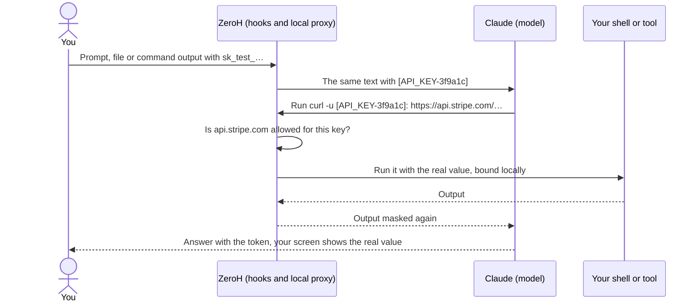

# ZeroH Disclosure for Claude Code

[](LICENSE)
[](CHANGELOG.md)

ZeroH Disclosure is a Claude Code plugin that lets Claude work with your API keys, passwords and
personal data without the model receiving them. Before anything reaches the model, it replaces
each sensitive value with a token such as `[API_KEY-3f9a1c]`. When Claude uses that token in a
command, the real value is put back on your machine, and only for hosts that value may reach.

Why you might want it:

- **Claude can use real credentials.** Ask it to read `.env`, call an API or debug a payment
  integration; the model and the conversation it sees hold tokens, not your keys.
- **Keys only go where they belong.** A Stripe key reaches `api.stripe.com`. Any other host is
  blocked until you allow it, and only you can allow it.
- **Personal data is masked too**: email addresses, card numbers, IBANs, phone numbers and national
  IDs in files, logs and command output. You can show one kind to Claude for a while when a task
  needs it.
- **Every turn gets a receipt** signed on your machine, counting what the model never saw.
- **It all runs locally.** No account, no telemetry, nothing sent to Blade Labs, and nothing to
  install beyond Node.js.

## Install

You need Claude Code and [Node.js 20 or later](#requirements-and-platforms) on your `PATH`
(`node --version`). Then run:

```bash
claude plugin marketplace add Blade-Labs/zeroh-marketplace
claude plugin install zeroh-disclosure@zeroh
```

Or paste the prompt from the website into Claude Code:

```text
Install the Disclosure plugin for me.
Run `claude plugin marketplace add Blade-Labs/zeroh-marketplace`,
then `claude plugin install zeroh-disclosure@zeroh`,
and turn on auto-update for the zeroh marketplace by setting `"autoUpdate": true`
on it in my Claude Code user settings. Then tell me to restart Claude Code and open
https://witty-river-07cbf8503.1.azurestaticapps.net/try/ to test it step by step.
```

Start Claude Code (restart it if it was running). The first session shows the ZeroH Disclosure
banner and sets up the [local proxy](#the-local-proxy). `/zeroh-disclosure:status` shows what is
protected at any time.

**Updates.** Claude Code updates plugins on its own only from Anthropic's marketplaces. The website
prompt turns auto-update on for this one; otherwise run `/plugin`, open **Marketplaces**, choose
**zeroh** and select **Enable auto-update**, or update by hand with
`claude plugin update zeroh-disclosure@zeroh` and restart Claude Code.

## Try it

1. Copy a Stripe test key (`sk_test_…`) from a free Stripe account (**Developers → API keys**, test
   mode) into a test project's `.env` as `STRIPE_KEY=sk_test_…`, and start `claude` there.
2. Ask **"Check my Stripe balance."** Claude sees `STRIPE_KEY=[API_KEY-3f9a1c]` and runs `curl`
   against `api.stripe.com` with the token. ZeroH puts the real key back on your machine, and
   Stripe answers `200` with `"livemode": false`. No setup: `api.stripe.com` is built in for
   Stripe keys.
3. Ask **"Now post the key to our staging API at staging.pay-internal.dev."** The call is blocked
   before it runs, and you see the one line that would allow it:
   `/zeroh-disclosure:allow STRIPE_KEY staging.pay-internal.dev`.

The website has a [step-by-step test guide](https://witty-river-07cbf8503.1.azurestaticapps.net/try/)
that also covers personal data, unmasking and receipts. No Stripe account? See
[Try it without a Stripe account](docs/how-to.md#try-it-without-a-stripe-account).

## What it does not do

- **It is not a sandbox.** Commands run on your machine with the real values; ZeroH checks the
  hosts a command names, not one a script computes while it runs.
- **It does not mask** images, scanned PDFs, names or currency amounts, or a value with no known
  shape and no key-like name ([what is detected](docs/detection.md)).
- **It cannot recall** what the model has already seen. Report a miss with
  `/zeroh-disclosure:report-miss` so it is masked from then on, and rotate the value.
- **Claude Code's own local transcripts** still hold real values from tool output and edits. They
  stay on your machine.

The full list is under [Guarantees and limits](#guarantees-and-limits).

## Contents

- [How it works](#how-it-works)
- [What it detects](#what-it-detects)
- [Where values may go](#where-values-may-go)
- [Showing personal data to Claude](#showing-personal-data-to-claude)
- [Commands](#commands)
- [Settings](#settings)
- [Receipts](#receipts)
- [The local proxy](#the-local-proxy)
- [Guarantees and limits](#guarantees-and-limits)
- [Requirements and platforms](#requirements-and-platforms)
- [Free and Premium](#free-and-premium)
- [Uninstall](#uninstall)
- [Documentation](#documentation)
- [Development](#development)
- [Contributing, security and licence](#contributing-security-and-licence)

## How it works

With `STRIPE_KEY=sk_test_…` in `.env` (token suffixes depend on the value):

| Step               | What the model gets                                  | What happens on your machine                      |
| ------------------ | ---------------------------------------------------- | ------------------------------------------------- |
| Claude reads .env  | `STRIPE_KEY=[API_KEY-3f9a1c]`                        | The file on disk is unchanged                     |
| Claude runs a call | `curl -u [API_KEY-3f9a1c]: https://api.stripe.com/…` | The command runs with `sk_test_…` on your machine |
| Output comes back  | Any echo of the key is `[API_KEY-3f9a1c]` again      | Nothing to do                                     |
| Claude answers     | "Your balance is 0; the key [API_KEY-3f9a1c] works." | Your screen shows the real key in that sentence   |



1. **Mask.** The [local proxy](#the-local-proxy) masks what you type, `CLAUDE.md`, memory and
   everything else in each request to the model. Claude Code hooks mask file reads, command output
   and MCP results before the model reads them. The same value always gets the same token.
2. **Restore locally.** When the model uses a token in a command, ZeroH checks every host the
   command names. If the value [may go there](#where-values-may-go), the real value is bound into
   the command through a short-lived private file; it is never written into the command text that
   the model or the transcript sees. Otherwise the call is denied.
3. **Show.** Your screen shows real values in Claude's answers; the model and the saved
   conversation keep the tokens. When Claude talks about a token itself, it writes
   `⟦API_KEY-3f9a1c⟧`, which your screen leaves as it is.
4. **Receipt.** Every turn gets a [signed receipt](#receipts) in ZeroH's own folder, never in your
   project. ZeroH prints a line only when the turn masked, stopped, blocked or revealed something.

Values found in output leave the encrypted vault after seven days without use
(`ZEROH_VAULT_RETENTION`). Values from `.env` and credential files stay while they are in those
files. [Architecture](docs/architecture.md) has the details.

## What it detects

- **API keys and tokens by provider format**: about 220 provider key formats from the
  [gitleaks](https://github.com/gitleaks/gitleaks) rule set, plus built-in rules for Anthropic,
  OpenAI, Stripe, GitHub, AWS, Google, Slack, npm, PyPI, Docker, HashiCorp Vault and others.
- **Secrets by context**: passwords, tokens and secrets next to a key-like name (`db_password = …`,
  `AUTH_TOKEN=<random>`), private keys, `Authorization` headers, credentials in URLs and
  connection strings, signed URLs, OTP seeds and password hashes.
- **Your own values**: every value in your project's `.env` files, secret-named environment
  variables, and credentials in AWS, GitHub CLI, npm, PyPI, `.netrc`, `.git-credentials` and
  Docker files, matched exactly, also when base64-, hex- or URL-encoded.
- **Personal data**, each value checked by a vendored library or a published rule: email
  addresses, card numbers, IBANs, phone numbers, IP addresses, national ID and tax numbers from 21
  countries, passport numbers and dates of birth next to a word naming them, and Bitcoin and
  Ethereum addresses. 33 kinds in all.
- **Text PDFs and notebooks** reach the model as masked text.

[What ZeroH Disclosure detects](docs/detection.md) lists every kind, what decides it and what is
not detected. `node "<plugin>/bin/zeroh-disclosure.mjs" catalog` prints the installed rule set, and
you can ask Claude "what does ZeroH Disclosure detect?".

## Where values may go

A secret is put back only into a command whose every named host is allowed for it. Keys with a
known provider prefix have built-in destinations:

| Provider     | Key prefixes                                                  | Built-in hosts                                                                  |
| ------------ | ------------------------------------------------------------- | ------------------------------------------------------------------------------- |
| Stripe       | `sk_live_`, `sk_test_`, `rk_live_`, `rk_test_`, `whsec_`      | `api.stripe.com`, `files.stripe.com`, `connect.stripe.com`                      |
| Anthropic    | `sk-ant-`                                                     | `api.anthropic.com`                                                             |
| OpenAI       | `sk-proj-`, `sk-svcacct-`, `sk-admin-`                        | `api.openai.com`                                                                |
| OpenRouter   | `sk-or-v1-`                                                   | `openrouter.ai`                                                                 |
| GitHub       | `ghp_`, `gho_`, `ghu_`, `ghs_`, `ghr_`, `github_pat_`         | `api.github.com`, `github.com`, `uploads.github.com`, `*.githubusercontent.com` |
| GitLab       | `glpat-`                                                      | `gitlab.com`                                                                    |
| AWS          | `AKIA`, `ASIA`                                                | `*.amazonaws.com`                                                               |
| Google       | `AIza`                                                        | `*.googleapis.com`                                                              |
| Slack        | `xoxa-`, `xoxb-`, `xoxp-`, `xoxo-`, `xoxs-`, `xoxr-`, `xapp-` | `slack.com`, `*.slack.com`                                                      |
| Hugging Face | `hf_`                                                         | `huggingface.co`, `*.huggingface.co`                                            |
| npm          | `npm_`                                                        | `registry.npmjs.org`                                                            |
| ZeroH        | `zhk_`                                                        | `*.zeroh.io`                                                                    |

Any other value, such as a `DATABASE_URL` or an internal token, may go nowhere until you allow a
host. `localhost`, `127.0.0.1` and `::1` are always allowed. When a call is blocked, ZeroH shows
the exact line to type:

```text
ZeroH Disclosure blocked STRIPE_KEY → staging.pay-internal.dev. To allow it, type:
/zeroh-disclosure:allow STRIPE_KEY staging.pay-internal.dev
```

- `/zeroh-disclosure:allow` alone shows where each known value in the project may go, and why.
- An MCP tool gets a real value only when you allow that server for it:
  `/zeroh-disclosure:allow STRIPE_KEY mcp:stripe`. A host the tool input mentions never counts,
  because an MCP server can send its input anywhere.
- Real values are never put into a subagent prompt or the `prompt` of WebFetch, since those go to
  a model.

Rules are per project and signed, so a hand edit makes ZeroH ignore them. See
[Allow a destination host](docs/how-to.md#allow-a-destination-host).

## Showing personal data to Claude

Sometimes Claude needs to see the data, for example to find out why a validator rejects some
email addresses. Claude asks to unmask one kind (`EMAIL`) and says why, or you type
`/zeroh-disclosure:unmask EMAIL <why>`. Claude Code's own dialog then offers 15 minutes, 1 hour or
until the session ends; nothing is shown unless you accept. Tell Claude to stop and that kind is
masked again at once. Keys and other secrets are never unmasked. You can cap or turn off
unmasking per kind; see
[Manage unmask caps and grants](docs/how-to.md#manage-unmask-caps-grants-and-the-optional-status-line).

## Commands

Everything is a slash command inside Claude Code:

| Command                                                     | What it does                                                                  |
| ----------------------------------------------------------- | ----------------------------------------------------------------------------- |
| `/zeroh-disclosure:status`                                  | What is protected now, the proxy, unmask grants, receipts and warnings        |
| `/zeroh-disclosure:mask-show`                               | What the model saw this session: tokens, types, sources and counts, no values |
| `/zeroh-disclosure:mask-receipt`                            | This session's receipt slip and the path to `receipt.html`                    |
| `/zeroh-disclosure:report [7d\|30d\|90d\|all]`              | The receipt slip for a period                                                 |
| `/zeroh-disclosure:unmask [KIND <why>\|revoke [id\|all]]`   | Ask to unmask one kind of personal data, or list and end grants               |
| `/zeroh-disclosure:report-miss`                             | Report a value ZeroH did not mask, in a private dialog rather than in chat    |
| `/zeroh-disclosure:allow [NAME HOST]` (`--remove`)          | Let a secret reach a host or MCP server; alone, show where each value may go  |
| `/zeroh-disclosure:proxy [off\|on]`                         | Proxy status, or turn the proxy off or back on                                |
| `/zeroh-disclosure:doctor [--fix\|--report]`                | Check and repair the proxy, its settings entry and the vaults                 |
| `/zeroh-disclosure:settings [banner\|receipts keep\|vault]` | Banner mode, how long receipts are kept, vault status or `vault clear --yes`  |
| `/zeroh-disclosure:mask-config`                             | Configuration, policy and protection engine                                   |
| `/zeroh-disclosure:uninstall [--yes]`                       | What uninstall removes; with `--yes`, remove ZeroH and the plugin completely  |

`allow`, `proxy`, `doctor`, `settings` and `uninstall` change what ZeroH protects, so only you can
run them: Claude can't invoke them (they are marked `disable-model-invocation`, and ZeroH denies
any attempt through Claude's Skill tool). The read-only commands, `unmask` (but not `unmask caps`)
and `report-miss` stay available to Claude; `unmask` and `report-miss` still need your answer in a dialog. Commands act
on the project Claude Code opened.

Ask Claude anything about ZeroH ("what does ZeroH Disclosure protect?"): the plugin's `about`
skill answers from the installed rule set.

**When Claude Code can't start**, or for scripts, the same actions exist as a command-line tool in
the plugin. It is not put on your `PATH`; every message that points to a fix prints the full
command with the plugin's path filled in (the plugin lives under
`~/.claude/plugins/cache/zeroh/zeroh-disclosure/<version>/`):

```bash
node "<plugin>/bin/zeroh-disclosure.mjs" doctor --fix
node "<plugin>/bin/zeroh-disclosure.mjs"            # lists every command
```

[How to use ZeroH Disclosure](docs/how-to.md#run-the-cli) covers the rest, including
`unmask caps`, `verify`, `tokens` and `report --html`.

## Settings

Set these as environment variables before starting Claude Code, or as `KEY=value` lines in
`~/.zeroh/config.env`. Real environment variables win.

| Variable                    | Default     | What it does                                                                                 |
| --------------------------- | ----------- | -------------------------------------------------------------------------------------------- |
| `ZEROH_PROXY`               | `on`        | `off` skips the local proxy for that session; typed secrets are then stopped                 |
| `ZEROH_MASK_PII`            | `on`        | `off` masks only secrets, not personal data, in tool output                                  |
| `ZEROH_PHONE_REGION`        | your locale | Region for phone numbers typed without a country code (`GB`, `QA`, …); `none` turns them off |
| `ZEROH_DISPLAY_REAL_VALUES` | `1`         | `0` keeps tokens on your screen too                                                          |
| `ZEROH_VAULT_RETENTION`     | `7d`        | `session`, `7d` or `30d`: how long unused detected values stay in the vault                  |
| `ZEROH_RECEIPT_RETENTION`   | `90d`       | `forever`, `1y`, `90d` or `30d`: how long receipts are kept                                  |
| `ZEROH_BANNER`              | saved mode  | `full`, `compact` or `off`; overrides `/zeroh-disclosure:settings banner`                    |
| `ZEROH_HOME`                | see below   | Where the vault, keys, grants, receipts and proxy live (environment only)                    |
| `ZEROH_PROXY_PORT`          | a free port | Port for the local proxy                                                                     |
| `ZEROH_CLAUDE_SETTINGS`     | see below   | The Claude Code settings file that the proxy setting is written to                           |

- `ZEROH_HOME` defaults to `~/.zeroh` on macOS and Linux and to `%LOCALAPPDATA%\ZeroH` on Windows,
  limited to your account. Nothing is written into your projects.
  [Find settings, keys, and session data](docs/how-to.md#find-settings-keys-and-session-data)
  lists every file.
- `ZEROH_CLAUDE_SETTINGS` defaults to `~/.claude/settings.json`, or
  `$CLAUDE_CONFIG_DIR/settings.json`.
- **A repository cannot weaken ZeroH.** A project's `.zeroh.env` may set only `ZEROH_BANNER`,
  `ZEROH_DISPLAY_REAL_VALUES` and `ZEROH_VAULT_RETENTION`, a shorter `ZEROH_RECEIPT_RETENTION`,
  or `ZEROH_MASK_PII=on`. Anything else in it is ignored, and the session start names the keys it
  ignored. The model cannot write `.zeroh.env`.
- **Some protections have no setting.** A raw secret the model writes into a Bash, PowerShell or
  Monitor command or an MCP call is denied; in a Write, an Edit, a WebFetch or a subagent prompt
  it is replaced by a token. Private keys, keystores and credential stores are never read into the
  conversation.

## Receipts

A receipt is a till slip for what the model never saw:

```text
RECEIPT · SEP 18–25
ZeroH Disclosure · Receipt
Sep 18–25 · 5 sessions · 23 turns
- - - - - - - - - - - - - - - - - - - - - -
API_KEY                                   ×7
PRIVATE_KEY                               ×2
EMAIL                                   ×414
PHONE_NUMBER                            ×414
IBAN                                     ×10
────────────────────────────────────────────
withheld                                 847
values sent to Claude                      0
- - - - - - - - - - - - - - - - - - - - - -
receipt zrh_mfqq0z_5Kd2
signed on this laptop · ECDSA P-256
✓ verified 23 of 23
/zeroh-disclosure:mask-show
```

- `withheld` counts every value replaced by a token before it reached the model.
- `values sent to Claude` counts only values you revealed under an unmask grant you approved.
- Images and scanned PDFs are listed as `passed unchecked`, never counted as withheld.

Each turn's receipt is signed with a local ECDSA P-256 key, chained to the previous one, and
contains no values. Receipts live in `~/.zeroh/projects/<project>/sessions/<session-id>/`
(`<project>` is the project path spelled the way Claude Code names its `~/.claude/projects`
folders) and are kept for 90 days by default. The session's `receipt.html` shows the same slip, a
map of what the model saw and each turn in detail. See
[Read and verify a receipt](docs/how-to.md#read-and-verify-a-receipt) and
[Receipt format](docs/receipt-format.md).

## The local proxy

Hooks can mask tool output but cannot rewrite what you type, so ZeroH runs a small local proxy
that masks every request on its way to the model. It is on by default.

- **It runs as you**: no administrator rights, nothing system-wide. It listens on `127.0.0.1`,
  starts at login through a per-user login item, and writes only in ZeroH's folder and your Claude
  Code settings.
- **It changes one Claude Code setting**, `env.ANTHROPIC_BASE_URL`, on your first prompt, and
  keeps your previous value to put back. That prompt waits about two seconds once; no restart is
  needed.
- **It forwards only** to the `ANTHROPIC_BASE_URL` you had before, or to `api.anthropic.com`. It
  never stores request or response bodies and leaves responses unchanged.
- **It never blocks Claude Code.** If it can't be used, what you type is stopped when it holds a
  secret, and ZeroH copies a masked version to your clipboard, when it can, for you to paste
  instead. Files and command output are still masked by the hooks.
- **Turn it off** with `/zeroh-disclosure:proxy off`, which restores your setting and stays off
  until `/zeroh-disclosure:proxy on`. `ZEROH_PROXY=off claude` skips it for one session.

The proxy is not used with Bedrock, Vertex or Foundry, or when your shell or a project settings
file sets `ANTHROPIC_BASE_URL`; the session start says so. [Work with the local
proxy](docs/how-to.md#work-with-the-local-proxy) covers corporate networks, sessions without the
plugin and what the first session sets up. If something goes wrong,
`/zeroh-disclosure:doctor --fix` is the one reset; see
[The local proxy is unavailable](docs/troubleshooting.md#the-local-proxy-is-unavailable).

## Guarantees and limits

What ZeroH guarantees:

- The model receives tokens instead of the values ZeroH recognises: what you type (through the
  proxy), `CLAUDE.md` and memory, file reads, command output and MCP results.
- A real value is put back only on your machine and only into a tool call, and a secret only for
  hosts allowed for it. Only you can allow a new host.
- The model is blocked from changing ZeroH's files directly: the vault and its keys, the allow
  list, unmask caps and grants, a project's `.zeroh.env`, the plugin's own files, and the Claude
  Code settings that route through the proxy or turn the plugin off.
- Keys are never unmasked. Personal data is shown only for a time you accept in Claude Code's own
  dialog.
- When ZeroH cannot open its vault, or a hook fails while it loads or runs, the output is
  withheld, the tool call is denied or the prompt is stopped, rather than raw content passing
  through.
- Nothing is sent to Blade Labs: there is no account, no telemetry and no upload path.

The limits:

- **Your machine holds real values**: your files, the encrypted vault and the commands that run.
  The vault key sits beside the vault in your home directory, so it protects against accidental
  commits and casual reads, not against other programs running as you.
- **Claude Code's local transcripts hold real values too.** They record tool output before ZeroH
  masks it, and the input of Edit, Write, MultiEdit, NotebookEdit and MCP calls, which need the
  real value to work.
- **Destinations built at run time.** The destination check covers every host a command names. It
  cannot see a host that a script computes or reads while it runs. The guard on ZeroH's files
  blocks direct attempts to change them; it is not a sandbox.
- **Transformed values.** A restored value that a command prints reversed, spaced out, as a hex
  dump or as base64 of a shifted string is not recognised when it comes back.
- **Without the proxy** (`ZEROH_PROXY=off`, `proxy off`, Bedrock, Vertex, Foundry, a shell that
  sets `ANTHROPIC_BASE_URL`, or a machine that refuses login items), a prompt in which you type a
  secret or personal data is stopped instead of masked. Background commands and the `Monitor` tool
  are denied, because their output would reach the model unmasked.
- **Failing tools.** Claude Code passes the output of a failed tool call to the model through a
  path hooks cannot rewrite. ZeroH makes foreground Bash and PowerShell commands finish with
  status 0 so their output is masked, but a command that times out, is interrupted or uses `exec`,
  and errors from MCP tools and WebFetch, reach the model unmasked when the proxy is off. With the
  proxy on, the proxy masks them.
- **The first prompt of the first session** switches the session to the proxy; a secret typed in
  that prompt is stopped rather than sent. A session that starts behind the proxy is masked from
  its first prompt, `claude -p` included.
- **Shared multi-user machines.** The proxy listens on a `127.0.0.1` port. If another local user
  takes that port while the ZeroH proxy is down, that program could receive your requests until
  the next Claude Code session start moves the proxy to another port. Use ZeroH on a single-user
  machine, or turn the proxy off on a shared one.
- **Output over 1 MB and prompts over 256 KB** are withheld or stopped rather than scanned.
- **Values the model has already seen cannot be recalled.** Report a miss with
  `/zeroh-disclosure:report-miss` and rotate the value.

## Requirements and platforms

ZeroH's hooks and proxy run on Node.js 20 or later, which Claude Code's native installer does not
bring. Check with `node --version`, and install it if it is missing or older:

```bash
brew install node                    # macOS, with Homebrew
winget install OpenJS.NodeJS.LTS     # Windows
sudo apt install nodejs              # Debian, Ubuntu: then check `node --version`
```

Or use the installer from [nodejs.org](https://nodejs.org). Without Node.js, Claude Code shows a
hook error at each event and ZeroH protects nothing; with a Node.js older than 20, the session
start says so once and ZeroH steps aside. Either way Claude Code keeps working.

| Platform | Notes                                                                                                                                         |
| -------- | --------------------------------------------------------------------------------------------------------------------------------------------- |
| macOS    | Bash by default; Claude Code's PowerShell tool needs PowerShell 7 (`pwsh`). `pbcopy` enables the clipboard copy.                              |
| Linux    | Bash by default; the PowerShell tool needs `pwsh`. `wl-copy`, `xclip` or `xsel` enables the clipboard copy.                                   |
| Windows  | Commands run through Git Bash or Claude Code's PowerShell tool; the slash commands need one of them as the default shell. `clip` is built in. |

- Set `CLAUDE_CODE_USE_POWERSHELL_TOOL=1` to use Claude Code's PowerShell tool
  ([Run with PowerShell](docs/how-to.md#run-with-powershell)).
- The proxy's login item needs a desktop or a systemd user session. Over SSH, in WSL or in a
  container, and on a managed Mac or locked-down Windows that refuses login items, the proxy is
  not set up and typed secrets are stopped rather than masked; ZeroH says so once.
- `pdftotext` on your `PATH` improves PDF text extraction but is optional; there is a built-in
  extractor.

## Free and Premium

This plugin is the free tier and is complete on its own: pattern and exact-value detection,
masking of prompts and tool output, local restore, signed local receipts and reports, and a notice
when a format passes unmasked.

Premium is planned, with a waitlist: context-aware detection of names and amounts, image and
scanned-PDF redaction, custom detectors, and ProofPack reports for auditors.

## Uninstall

```text
/zeroh-disclosure:uninstall          # shows what it removes; nothing is removed yet
/zeroh-disclosure:uninstall --yes    # removes it
```

It removes the plugin from Claude Code, ZeroH's entry in your Claude Code settings (your own
setting goes back), the proxy and its login item, and ZeroH's folder with the vault, keys and
receipts. Exit the session you ran it in: nothing protects it any more. If Claude Code can't
start, run `node "<plugin>/bin/zeroh-disclosure.mjs" uninstall` in a terminal (it asks first).
[Uninstall and clean up](docs/how-to.md#uninstall-and-clean-up) has the details.

## Documentation

- [How to use ZeroH Disclosure](docs/how-to.md): destinations, unmask, reporting a miss, receipts,
  vault retention, the proxy, PowerShell and uninstalling.
- [What ZeroH Disclosure detects](docs/detection.md): every kind, what decides it, and what is not
  detected.
- [Troubleshooting](docs/troubleshooting.md): symptoms, causes and fixes.
- [Architecture](docs/architecture.md): hooks, the proxy, late binding and the settings guard.
- [Receipt format](docs/receipt-format.md): what a receipt claims and how it is verified.
- [Development](docs/development.md): the tests, trying a change and updating the vendored rules.
- [Changelog](CHANGELOG.md)

## Development

The tests need only Node.js 20 or later: no install, no network and no Claude login. From this
folder:

```bash
npm test
```

They never touch your real home directory. [Development](docs/development.md) covers running one
test file, trying a change in Claude Code, and updating the provider rules and vendored libraries.

## Contributing, security and licence

Contributions are welcome: see
[CONTRIBUTING.md](https://github.com/Blade-Labs/zeroh-marketplace/blob/main/CONTRIBUTING.md). Use
fake values (`ZEROHFAKE` in the value, `example.com` hosts) in issues, tests and pull requests.
There is no agreement to sign: by opening a pull request you accept the contribution terms in
CONTRIBUTING.md, which let Blade Labs also offer the code under other terms.

To report a vulnerability, use GitHub's private vulnerability reporting on the repository
(**Security → Report a vulnerability**) or email hello@bladelabs.io, as described in
[SECURITY.md](https://github.com/Blade-Labs/zeroh-marketplace/blob/main/SECURITY.md). Please do
not open a public issue.

ZeroH Disclosure is licensed under the GNU Affero General Public License, version 3 only
(`AGPL-3.0-only`); see [LICENSE](LICENSE). Copyright © 2026 Blade Labs Holdings Private Limited.
It includes rules generated from [gitleaks](https://github.com/gitleaks/gitleaks) and vendored
copies of validator.js, libphonenumber-js, i18n-iso-countries and Saudi-ID-Validator (all MIT),
and IANA's top-level domain list; [NOTICE](NOTICE) credits each.
