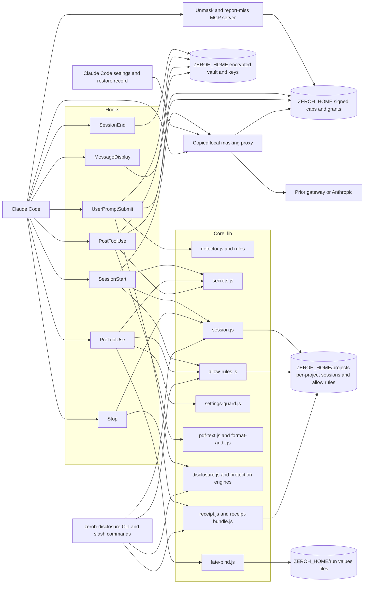
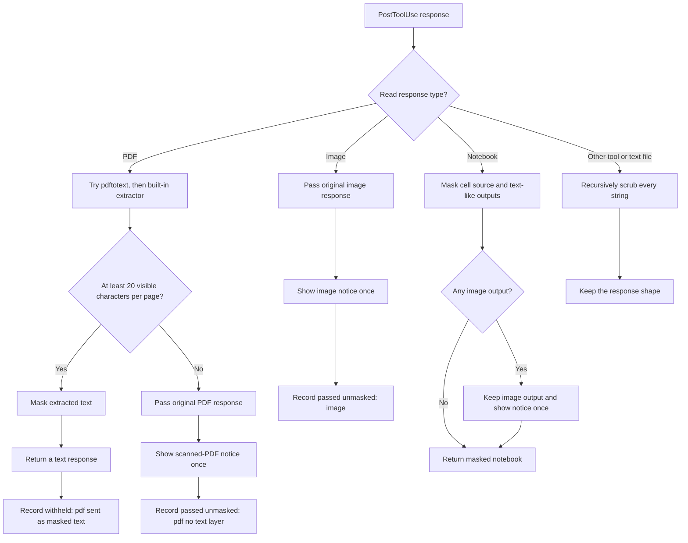

# ZeroH Disclosure architecture

The plugin is a local pipeline of Claude Code hooks and a local proxy. It replaces sensitive values
with tokens, restores them only for local tools, and writes signed evidence per turn. For a map of
the source files, see [Where things live](development.md#where-things-live).

## Contents

- [Components](#components)
- [Hook lifecycle](#hook-lifecycle)
- [Local proxy](#local-proxy)
- [Local unmask grants](#local-unmask-grants)
- [Vault and tokens](#vault-and-tokens)
- [Destination enforcement](#destination-enforcement)
- [PostToolUse format decisions](#posttooluse-format-decisions)
- [Bash late binding](#bash-late-binding)
- [PowerShell late binding](#powershell-late-binding)
- [Literal restore](#literal-restore)
- [Exit-status wrapper](#exit-status-wrapper)
- [Settings guard](#settings-guard)
- [Evidence contracts](#evidence-contracts)
- [Project root](#project-root)

## Components



The hooks and default local proxy use Node built-ins and the libraries vendored under `vendor/`
(validator.js, libphonenumber-js, i18n-iso-countries and Saudi-ID-Validator, which decide what
counts as personal data); the proxy's runtime copy under `ZEROH_HOME` takes those vendored folders
with it. [What ZeroH Disclosure detects](detection.md) lists the rules.

## Hook lifecycle

Every hook runs through `hooks/run.js <hook>`, a loader that reads the event and installs the
fail-closed answers before it loads the hook. So a hook that cannot even load (a syntax error, a
missing module) still stops the prompt, denies the tool call or withholds the tool output, like one
that fails while it runs (`hooks/fail-closed.js`).

| Hook               | Responsibility                                                                                                                                                                                                                                                                                                                            |
| ------------------ | ----------------------------------------------------------------------------------------------------------------------------------------------------------------------------------------------------------------------------------------------------------------------------------------------------------------------------------------- |
| `SessionStart`     | Removes stale run files, opens the local session, loads known values into the vault, checks the signed allow list, scans `CLAUDE.md`, imports, and memory, and gives Claude token-handling instructions.                                                                                                                                  |
| `UserPromptSubmit` | Applies the disclosure policy and creates the turn ledger. When the daemon confirms that this session's requests pass through the proxy, the proxy is the masking boundary and the prompt goes on; otherwise a sensitive prompt is blocked and a masked copy is offered for resubmission. Any error before the prompt is cleared exits 2. |
| `PreToolUse`       | Applies the settings and sensitive-file guards before loading configuration, denies background shells and Monitor without the proxy, checks tool input policy, restores known tokens, enforces destinations, late-binds Bash or PowerShell values, and adds the exit-status wrapper. Any error denies the call.                           |
| `PostToolUse`      | Deletes any values file for the tool call (best effort), handles PDF, image, and notebook responses, and recursively masks strings in other tool output. Any error, and output over 1 MB, replaces the complete output with a notice in the tool's own shape.                                                                             |
| `MessageDisplay`   | Replaces known tokens in display deltas with vault values unless `ZEROH_DISPLAY_REAL_VALUES=0`. It does not change the stored assistant message; a vault error leaves tokens visible.                                                                                                                                                     |
| `Stop`             | Finalizes ledgers (which never hold the typed prompt, only masked text), writes signed receipts, writes `receipt.html`, and builds the session receipt bundle.                                                                                                                                                                            |
| `SessionEnd`       | Applies vault retention with the policy `SessionStart` stored: under `session` retention it removes the values the ending session used; under `7d` or `30d` it removes values past the window.                                                                                                                                            |

### Naming a token

The screen shows the real value for every plain `[TYPE-xxxxxx]` in Claude's reply,
so a sentence about the token itself ("I saw the token [API_KEY-3f9a1c]") would show the key, as if
the model had seen it. Nothing leaks, but the display rules cannot tell which of the two the model
means: "STRIPE_KEY=[API_KEY-3f9a1c]" and "I saw [API_KEY-3f9a1c]" have the same shape. So the model
says it with the form it writes: `⟦TYPE-xxxxxx⟧` names the token and is never restored.
`SessionStart` explains the form once; on each turn that brings tokens, one short reminder tells the model
of it (`namingReminder` in `lib/token-pattern.js`): `UserPromptSubmit` adds it to the token map of
a prompt that references tokens, and otherwise the first `PostToolUse` that masks output in the
turn adds it to its context (a per-turn marker keeps it to once). `MessageDisplay` keeps a narrow
safety net for the one unambiguous case: the word `token` or `placeholder` directly before a plain
token (backticks allowed), or `is`/`was` `a`/`the`/`just a`/`only a` `token`/`placeholder`
directly after it, shows that token as `⟦TYPE-xxxxxx⟧`. Only the keywords ignore case; a keyword
inside a name (`GITHUB_TOKEN`) does not count, and every other plain token shows the real value.

## Local proxy

The local proxy is a separate request boundary. It masks user text, tool-result content, and the
text of system blocks, including `CLAUDE.md`, imports, and auto-memory. It refuses a text field
over 16 MiB or a body over 256 MiB instead of forwarding it, forwards `anthropic-*`,
`x-claude-code-*`, and authorization header values unchanged, and logs counts only. Thinking and redacted-thinking blocks, signatures, cache markers, tool
definitions, array order, and responses are unchanged. Deterministic tokens keep repeated system
text byte-identical after masking so prompt caching remains useful.

`SessionStart` copies the proxy runtime to `ZEROH_HOME/bin` when its build (plugin version and a
hash of its code) is newer than the copy, starts the daemon detached on `127.0.0.1` (replacing a
running daemon of an older build), verifies it answers with a proof of this home's control token,
registers a per-user login item (a refusal is a warning, not an error). The first prompt of a
session that does not use the proxy yet writes `env.ANTHROPIC_BASE_URL` as
`http://127.0.0.1:<port>/z/<key>` through the single settings-path resolver and waits two seconds:
Claude Code applies a changed settings file to the running session, so that prompt already goes
through the proxy (a write at `SessionStart` lands before Claude Code watches the file and is
missed). A session whose `ANTHROPIC_BASE_URL` comes from elsewhere (the shell, a higher-precedence
settings file) is never routed, and its typed secrets are stopped.

The proxy's state is one file, `<ZEROH_HOME>/proxy/proxy.json`: the port, the control
token, and one install per settings file (its key, upstream and the user's previous
`ANTHROPIC_BASE_URL`), written under a lock. A restore record next to each settings file holds the
previous `ANTHROPIC_BASE_URL` and the URL ZeroH wrote, so two Claude profiles share one daemon and
`proxy off` can restore the original URL after `ZEROH_HOME` is gone. No copy of the settings file is
kept. The daemon accepts only origin-form API paths under a known key and forwards to that
install's upstream, never to itself or another host; an upstream is checked when it is recorded,
and again for every request. A malformed request gets an error and never stops the daemon; a
client disconnect aborts the upstream request.

Every hook (`SessionStart`, `UserPromptSubmit`, `PreToolUse`, `PostToolUse`) refreshes a
per-session route file (`<ZEROH_HOME>/proxy/routes/`) holding the project root, the settings file
it belongs to and the session's `ZEROH_PROXY=off` choice; `SessionEnd` marks it ended. A request
with a body is masked with the project vault of the live route of its `x-claude-code-session-id`,
and the daemon records that it has seen the session. A request without a session header, or of a
session no hook registered, is masked while any plugin session of the same settings file is live
and not ended (with that project's vault, or with each live project's vault in turn), and passes
through unmasked only when none is: the plugin is disabled or removed everywhere. A session
opted out passes through. Routes older than 36 hours are pruned. Hooks decide whether typed secrets
are masked by asking the daemon about their own session (with a nonce proof), and then either by
the daemon's record that it has seen a request under that session id, or by the hook's own
environment naming this install's proxy URL for the active settings file: Claude Code then
sends the session's requests there, and the daemon masks the session's own requests and, while it
is live, any it cannot attribute. Only a session put behind the proxy by the current prompt (its
environment does not name the proxy yet) waits for "seen". Nothing in the environment alone can
claim masking, and Bedrock, Vertex and Foundry count as unmasked. Measured on Claude Code 2.1.283: every request
with a body carries the session id (subagents, `--resume`, `--continue` and `--fork-session`
included); only `HEAD /api/hello` has none, and on resume one start-up quota request carries a new
id before the session switches to the resumed one. Provider
authentication environment values are neither catalogued nor copied into the daemon environment.

After 24 hours without a live route from an installed plugin, the daemon restores every recorded
settings file, unregisters the login item, logs one line, and exits. It also exits within seconds
when `proxy.json` is deleted (removing its login item) or replaced by another daemon's, on
SIGTERM, SIGINT or SIGHUP (shutdown, logout, `systemctl --user stop`), and at once when its port is
taken. Before it leaves for a deleted home or a signal it takes its entries out of the settings
files it serves (`takeEntryOut`, the one rule for taking an entry out), except for a settings file
with a live plugin session it has masked (seen, not ended, within the route window; remembered
from the routes while the home exists): Claude Code applies a changed settings file to a running
session, so the rest of that session's turn would go straight to the API with its whole history.
That session's next prompt restarts the daemon. While the home exists it decides under the
manager lock; when someone else holds the lock (a re-registered login item boots the daemon out
during `SessionStart`), it keeps every entry. A leaving daemon releases its port at once and drains
open requests for up to ten minutes.

The daemon reaches its upstream with explicit agents built
from the network environment (`HTTPS_PROXY`, `HTTP_PROXY`, `NO_PROXY`, `NODE_EXTRA_CA_CERTS`,
`SSL_CERT_FILE`) that `SessionStart` records in `proxy.json`; a session with a different one
restarts it. When the recorded network proxy itself cannot be reached, the daemon drops it (in
memory and in `proxy.json`, keeping the CA files) and connects directly. A network failure on the
way to the upstream is a retryable 502; everything else the proxy produces is a final 4xx with the
fix. A start that finds the port taken by another program moves to a free port and rewrites the
entry.

`proxy off` restores the current settings file, records the choice next to it (hooks and `SessionStart` honour
it until `proxy on` or `doctor --fix`) and stops the daemon when no other settings file uses it;
`doctor --fix` does the same without recording, forgets a `proxy off`, and also stops any ZeroH
daemon it finds by probing the ports ZeroH records name, except this home's daemon while another
settings file uses it. A failed `SessionStart` never stops the daemon; it only removes its own settings
entry when that entry points at a proxy that does not answer. Restores change only
`ANTHROPIC_BASE_URL` (and an `env` object ZeroH created and left empty); writes follow symlinks,
keep the file mode, and retry a locked rename on Windows.

The proxy masks every text field: user text with the prompt rules, and tool results, documents
(text, content and `text/*` base64 sources), the system prompt and assistant turns (model output,
which may hold restored tool input) with the tool rules. Image and PDF base64 data pass unchanged.
A non-JSON body, or a text field over 16 MiB, is refused instead of forwarded.

## Local unmask grants

The plugin-root `.mcp.json` starts `mcp/server.mjs` over stdio. The server is handwritten with
Node built-ins and exposes three tools: `request_unmask {kind, reason}`, `end_unmask {kind|all}`
and `report_missed_secret {value, type_guess, where, why}`. `end_unmask` needs no dialog: it only
ends grants (a signed revoke receipt with `by: end_unmask`), never creates or extends one. At initialization it records
whether the client advertised MCP elicitation. A missing capability or Claude Code's `sdk-cli`
headless entrypoint causes an immediate refusal, so print mode and older clients never wait for
input and never receive a grant. Claude Code advertises elicitation in print mode but auto-declines it,
so the entrypoint check makes that refusal explicit before a request is sent. `report_missed_secret`
masks the value first and then asks whether to keep its shape-only report on this computer
(preselected) or delete it;
the dialog says that sending to Blade Labs comes in 1.1, and there is no network sender.

Personal-data caps in `<ZEROH_HOME>/unmask.json` and per-project grant stores in
`<ZEROH_HOME>/grants/<project-hash>.json` are HMAC-signed with the allow-list key. Secrets are
classified before elicitation and fixed at cap zero. On acceptance, the server writes a timed or
session-bound grant plus a local grant receipt. Decline, cancel, unknown actions, invalid duration
content, invalid signatures, and cap zero all fail closed.

`PreToolUse` creates a locked, one-shot session claim for `request_unmask`; the MCP server
atomically consumes it before elicitation. This prevents parallel Claude sessions from binding a
session grant to one another. The proxy applies a grant only to the session named in the
request's `x-claude-code-session-id` header.

`PostToolUse` and the proxy load and verify grants on each call. The scrubber skips only active
grant kinds. Other findings follow the normal mask path. A later tool result that contains an
unmasked value adds a `revealed_under_grant` count and grant ID to the current turn receipt. The
local receipt extension is HMAC-authenticated with the allow-list key, updated under a file lock,
required by a marker in the compact signed receipt, verified locally, and carried into the
receipt bundle; an output is withheld if its reveal cannot be recorded. Previous conversation content
is not rewritten. `UserPromptSubmit` emits the active countdown as a one-line `systemMessage`.
The main Claude Code status line remains user-owned; the optional `zeroh-disclosure statusline`
command prints the same text.

## Vault and tokens

The vault creates its key with exclusive-create semantics. Saves take an exclusive sibling lock,
remove only stale locks, re-read and merge the encrypted map while holding the lock, then replace it
with a temporary-file rename. Token names are HMAC-SHA256 of `type:value`, truncated to six hex
characters, under a per-install token key derived from the vault key, so a token cannot be used to
test guesses of the value. A value already in the vault keeps its stored token, including tokens
minted by earlier versions. Token collisions probe `type:value:N` instead of overwriting an
existing value.

## Destination enforcement

Destination enforcement extracts scheme and scheme-less URLs, bare public-looking domains,
IPv4/IPv6 literals, `user@host`, `host:port`, and PowerShell `-Uri` values from the complete restored
tool input, without the file paths of local file tools. Words ending in a source/data extension
that is also a TLD (`.py`, `.sh`, `.md`, `.tf`, `.zip` …) are files unless a URL, `user@` or a
network command's operand makes them a host; path-shaped dotted words, calls, member access on
common receivers (`user.email`), and loopback hosts are excluded. Each discovered host must be
allowed for every restored token. Subagent (Agent) input and the WebFetch `prompt` are never
restored. MCP input (other than ZeroH's own tools, which always keep tokens) is restored only for
values the user allowed for that MCP server with a signed `mcp:<server>` rule; hosts or loopback
URLs the input mentions never count, and other tokens pass through with a note to the model. The
hosts an allowed call names must still be allowed for the value.

## PostToolUse format decisions



For notebooks, text-like output includes `text`, `traceback`, `evalue`, `text/plain`, `text/html`,
`text/markdown`, and `application/json`. Image media stays unchanged. Notice markers and format
counts are stored in the active session. Failure to persist a format audit never turns a readable
file into a denial.

## Bash late binding

`PreToolUse` first restores a copy of the input for destination inspection. If the destination is
allowed, `late-bind.js` rewrites the model's original tokenised command to refer to shell
variables. The real values go into:

```text
<ZEROH_HOME>/run/<session-id>/<tool-use-id>.sh
```

The directory is requested as `0700` and the file as `0600`. The final command sources the file,
deletes it, and then runs the rewritten command in a group. A file that cannot be sourced prints
`[ZeroH could not load the restored values, so the command did not run]` and the command does not
run; a file that cannot be deleted (a read-only run directory) does not stop the command, and
`PostToolUse` removes it.

| Bash token context                   | Rewrite behaviour                                                                         |
| ------------------------------------ | ----------------------------------------------------------------------------------------- |
| Unquoted                             | Insert a double-quoted parameter expansion.                                               |
| Inside double quotes                 | Insert a parameter expansion without adding another quote pair.                           |
| Inside ordinary single quotes        | Close the single-quoted text, insert a double-quoted parameter expansion, then reopen it. |
| Inside `$(...)` or backticks         | Apply the same context rules inside the nested substitution.                              |
| Inside ANSI-C `$'...'`               | Close the ANSI-C string, insert a double-quoted expansion, then reopen it.                |
| Backslash immediately before a token | Preserve the intended literal backslash and use parameter expansion.                      |
| Unquoted heredoc body                | Use parameter expansion in the heredoc body.                                              |
| Quoted heredoc body                  | Unquote the delimiter, escape special body characters, then use parameter expansion.      |
| Comment                              | Leave the token text alone; it is not bound.                                              |

The scanner tracks nested substitutions and their local quote state. Quoted heredocs become
unquoted only after backslashes, dollar signs, and backticks in the body are escaped so their text
keeps the same meaning. An unterminated quote, substitution, or heredoc is denied.

## PowerShell late binding

PowerShell uses the same lifecycle with a values file of `NAME=<base64 of the UTF-8 value>` lines:

```text
<ZEROH_HOME>/run/<session-id>/<tool-use-id>.b64
```

| PowerShell token context   | Rewrite behaviour                                                                                  |
| -------------------------- | -------------------------------------------------------------------------------------------------- |
| Unquoted or double-quoted  | Insert the braced `${ZH_TYPE_hash}` form, including next to variable-name characters.              |
| ASCII single-quoted string | Convert the whole literal to double quotes, escape its literal metacharacters, and interpolate.    |
| Single-quoted here-string  | Convert it to a double-quoted here-string, escape literal backticks and dollar signs, interpolate. |
| Double-quoted here-string  | Insert the braced variable form.                                                                   |
| Escaped token              | Replace it with the braced variable form.                                                          |
| Line or block comment      | Leave the token text alone; it is not bound.                                                       |

PowerShell typographic quote characters are denied because their parsing is not portable enough to
prove a safe rewrite. Unterminated strings, here-strings, and block comments are also denied.

The final command reads the file with `[IO.File]::ReadAllLines` (no execution policy applies and
Windows PowerShell 5.1 cannot misread its encoding), removes it without failing if it cannot, sets
the variables, and then runs the rewritten command. If the file cannot be read, the command throws
`ZeroH could not load the restored values, so the command did not run: <reason>`, which the
exit-status wrapper prints. PowerShell 7 or later is required as `pwsh` for opt-in PowerShell use
on macOS and Linux.

## Literal restore

Bash and PowerShell never receive a literal restored value in `updatedInput`. When the scanner
cannot prove a rewrite safe, `PreToolUse` denies the call, identifies the token and reason, and asks
Claude to use a plain argument, double quotes, or a variable.

The one remaining literal-restore case is a non-shell tool whose input must carry the value: Edit,
Write, MultiEdit, NotebookEdit, and MCP calls. Claude Code can save those `updatedInput`
attachments in its local transcript. Bash and PowerShell never take this path.

`PostToolUse` deletes both possible values-file names for the completed tool call. `SessionStart`
and `Stop` prune files older than ten minutes.

## Exit-status wrapper

Claude Code routes a command that exits non-zero to `PostToolUseFailure`, whose output schema
accepts only `additionalContext`; the failing command's output would reach the model unmasked. So
`PreToolUse` rewrites every foreground Bash and PowerShell command, after late binding, to finish
with status 0 (`lib/exit-status.js`):

- Bash: ` || echo '[ZeroH: the command failed with a non-zero exit status]'` after the last
  command. When the command ends with a heredoc body, the suffix goes on the heredoc's opening
  line. Claude Code's permission rules check the rewritten command; this suffix keeps prefix allow
  rules working. A command that can leave the shell early (`exit`, `logout`, `set -e`, `source`,
  `.`) or that ends in a comment gets an `EXIT` trap instead, which reports the exact status and
  needs the user's approval.
- PowerShell: the command is kept as a single-quoted string, parsed, compiled with
  `[ScriptBlock]::Create` and dot-sourced inside `try`/`catch`/`finally`. A syntax error is caught
  and printed like any other error instead of stopping the script before the wrapper runs, and
  `using`, `param(...)` and `#requires` stay first in their own script. The `finally` block turns
  an early `exit` into status 0 and a trailing line reports `$LASTEXITCODE` (else `$?`), the status
  Claude Code would have used, then resets `$LASTEXITCODE`.

Background commands keep their status: their output bypasses `PostToolUse` and is denied without
the proxy. Timeouts, interrupts and `exec` still end in `PostToolUseFailure`, as does a hook
process that fails before its error handlers are installed (a module that cannot load); with the
proxy on, the proxy masks that output.

## Settings guard

`settings-guard.js` protects:

- the full user `ZEROH_HOME` directory, except Read and Grep access to the project's receipts
  under `<ZEROH_HOME>/projects/<project>/sessions` (nothing lives in the project);
- a `<project>/.zeroh` folder left by an earlier build;
- `.zeroh.env` and `.zeroh.policy` (Read stays allowed; earlier builds read `.zeroh.policy`);
- Claude Code settings files (user, `CLAUDE_CONFIG_DIR`, project, local and managed) against
  changes that disable hooks, disable or remove the plugin, change `ZEROH_*` or
  `ANTHROPIC_BASE_URL`, or add an `Elicitation` hook. File tools are judged by parsing the JSON the
  write would leave, so escapes and key order do not matter; unparseable results are denied;
- the plugin's own directory, installed plugins and proxy restore records; and
- `claude plugin disable|uninstall|remove` and `claude config set|add|remove`.

The guard resolves existing path prefixes to catch symlinks. Windows path separators are
normalised. Comparisons are case-insensitive on Windows and macOS and case-sensitive on Linux.

It checks file targets for Read, Edit, Write, MultiEdit, NotebookEdit, and Grep. It scans Bash and
PowerShell command strings and all MCP string leaves for protected paths, `ZEROH_HOME`, key,
allow, cap and grant filenames, and direct management-CLI invocation. A shell command that names a
Claude settings file or plugin path is allowed only when it is a single read-only command (`cat`,
`grep`, `jq` and similar, without redirection or substitution). It also rejects model writes
that mention `Elicitation` or `ElicitationResult` hooks, including JSON and shell escapes, when
their target is a Claude settings file or a plugin hook file.
A protected ZeroH path match is denied with:

```text
ZeroH Disclosure settings can only be changed by the user. Do not edit or read them; ask the user.
```

Static checks cannot stop a command from constructing a protected path at run time. The guard is
a direct-access control and audit signal, not a shell sandbox.

## Evidence contracts

The architecture uses three linked evidence layers:

1. A turn ledger records the sanitised text, findings, replacements, receipt, token-chain link,
   and format disclosure counts.
2. A signed receipt exposes public claims and selectively disclosable details.
3. A session receipt bundle contains receipt records, summary counts, and chain evidence.

[Receipt format](receipt-format.md) documents the contracts. Receipts are signed and verified
locally; verification makes no network call.

## Project root

Sessions, the vault, allow rules and `.zeroh.env` all key on one project root:
`CLAUDE_PROJECT_DIR`, else the hook event's working directory, else the process's working
directory. The CLI, the slash-command scripts and the MCP server resolve it the same way, and the
CLI's `--cwd` overrides it. The allow command suggested in a destination denial passes `--cwd`, so
running it from a subdirectory still writes the rule the hooks read.
