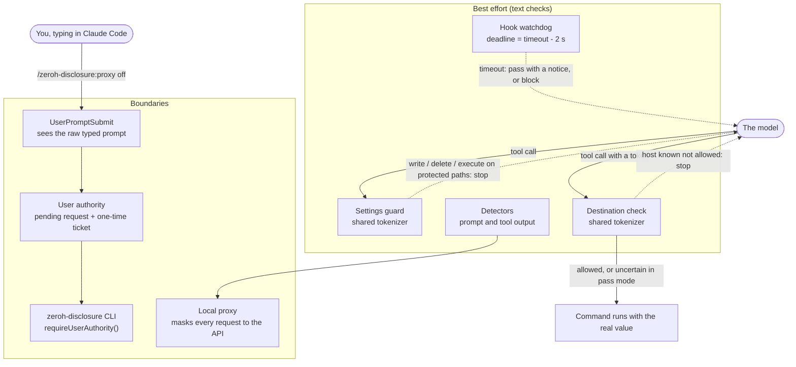
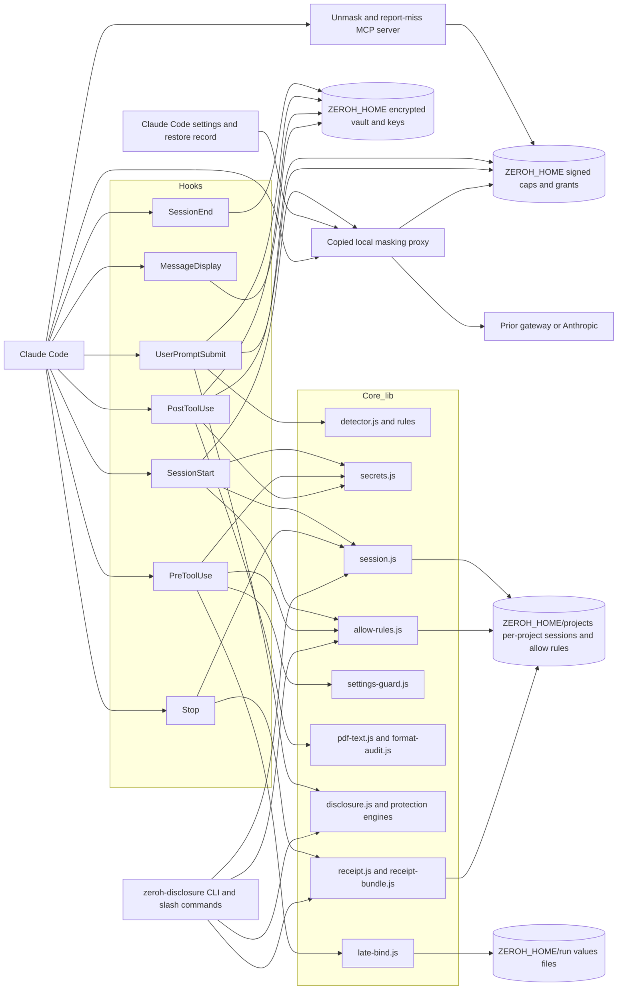
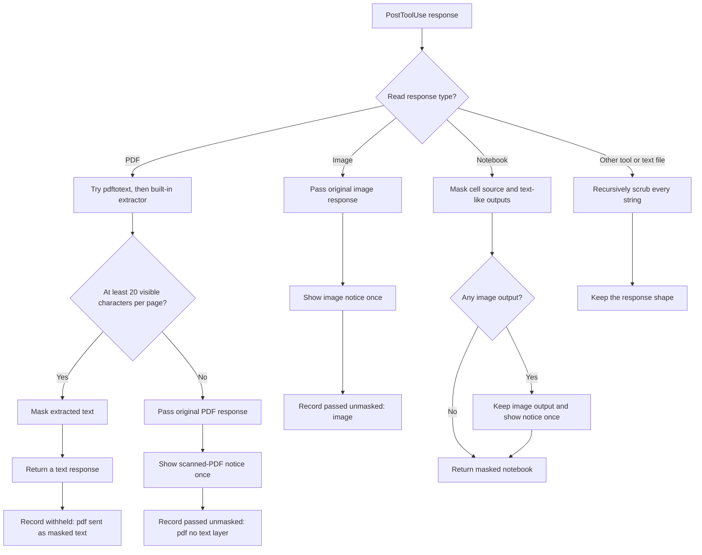

# ZeroH Disclosure architecture

The plugin is a local pipeline of Claude Code hooks and a local proxy. It replaces sensitive values
with tokens, restores them only for local tools, and writes signed evidence per turn. For a map of
the source files, see [Where things live](development.md#where-things-live).

## Contents

- [Threat model](#threat-model)
- [Components](#components)
- [Hook lifecycle](#hook-lifecycle)
- [Local proxy](#local-proxy)
- [Local unmask grants](#local-unmask-grants)
- [Vault and tokens](#vault-and-tokens)
- [Destination enforcement](#destination-enforcement)
- [PostToolUse format decisions](#posttooluse-format-decisions)
- [Bash late binding](#bash-late-binding)
- [PowerShell late binding](#powershell-late-binding)
- [Literal restore](#literal-restore)
- [Exit-status wrapper](#exit-status-wrapper)
- [What the Stop line may show](#what-the-stop-line-may-show)
- [Settings guard](#settings-guard)
- [Status line](#status-line)
- [Evidence contracts](#evidence-contracts)
- [Project root](#project-root)

## Threat model

ZeroH runs inside Claude Code as the same operating-system user as the model's shell. Anything
that user can do, a command the model writes can also do, so most of ZeroH's checks read text and
are best effort. This section says which parts are a boundary and which are not.
[Product principles](product-principles.md) set the defaults.


```mermaid
flowchart TB
    User([You, typing in Claude Code])
    Model([The model])

    subgraph Boundary["Boundaries"]
        UPS["UserPromptSubmit<br/>sees the raw typed prompt"]
        Auth["User authority<br/>pending request + one-time ticket"]
        CLI["zeroh-disclosure CLI<br/>requireUserAuthority()"]
        Proxy["Local proxy<br/>masks every request to the API"]
    end

    subgraph BestEffort["Best effort (text checks)"]
        Guard["Settings guard<br/>shared tokenizer"]
        Dest["Destination check<br/>shared tokenizer"]
        Scan["Detectors<br/>prompt and tool output"]
        Watchdog["Hook watchdog<br/>deadline = timeout - 2 s"]
    end

    User -->|/zeroh-disclosure:proxy off| UPS --> Auth --> CLI
    Model -->|tool call| Guard
    Model -->|tool call with a token| Dest
    Guard -.->|write / delete / execute on protected paths: stop| Model
    Dest -.->|host known not allowed: stop| Model
    Dest -->|allowed, or uncertain in pass mode| Shell[Command runs with the real value]
    Scan --> Proxy
    Watchdog -.->|timeout: pass with a notice, or block| Model
```

**Boundaries:**

- **User authority for management actions.** Turning the proxy off or on, `doctor --fix`,
  uninstall, allow rules, unmask caps, clearing the vault, keeping receipts, the banner and the
  `uncertain` setting all change what ZeroH protects. A slash command's `!` block only records a
  pending request (0600, 60 s). UserPromptSubmit performs the action only when the raw typed prompt
  matches that request. The CLI refuses these subcommands without a one-time ticket minted on that
  path, or a human confirmation in a terminal outside Claude Code: no Claude Code environment or
  ancestor process, plus a one-time code shown and typed back on the controlling terminal.
- **The local proxy.** Every request to the API passes through it, so what it masks never
  reaches the model, whatever a hook missed.
- **Opt-in strict mode** (planned for 1.0) will add Claude Code's sandbox as an operating-system
  boundary.

**Best effort:**

- **The settings guard and the destination check** read the model's commands with one shared Bash
  tokenizer (checked against real bash) and a conservative PowerShell parser. A command can still
  build a path or a host at run time.
- **Unknown scripts and interpreters** that receive a secret (`node x.js`, `python -c`, a pipe
  into a shell, `source x.sh`, sed's `e`, awk's `system()`) cannot be followed; their destination
  is unknown. Neither can a Git command that talks to a remote without naming it (the remote and
  its URL come from the repository's configuration), nor a `gh` command that names no host (gh's
  configuration picks it).
- **A nested `claude -p "/zeroh-disclosure:proxy off"`** imitates a typed prompt, and code running
  as the same user can forge the hook input or read a ticket from a process environment for the
  milliseconds it exists. Per-turn tamper checks (1.0) are the mitigation.
- **Hook time limits.** The watchdog answers 2 s before Claude Code's timeout, so a slow scan
  never falls through silently.

**Outside ZeroH: Claude Code's session files.** Claude Code saves each session to
`<CLAUDE_CONFIG_DIR or ~/.claude>/projects/<project>/<session>.jsonl`. It saves the prompt as the
user typed it, before the proxy masks the request, so a secret typed into a prompt is in that
file as it is (1.0.1, Mac /try review C1). Tool output and file reads are saved with tokens,
because PostToolUse rewrites them before Claude Code stores them; the inputs ZeroH restores into
Edit, Write, MultiEdit, NotebookEdit and MCP calls are saved with the real value (see
[Literal restore](#literal-restore)), and so are values shown under an unmask grant. ZeroH does
not rewrite these files. The session briefing says so, and a shell command that names them
(`lib/transcript-files.js`) runs with a notice for the user and a note for Claude; `uncertain
block` stops it. The check is best effort: it matches a `.claude`, `.claude-<name>` or
`.claude.<name>` folder (not `.claude-plugin`), then its `projects` folder, a project folder or a
`.jsonl` file below it, and leaves Claude Code's auto-memory (`projects/<project>/memory/`) alone.
It does not recognise a path it can't see in the command, such as `cd ~/.claude && cp projects/…`
or `tar -C ~ .claude`.

### Pass mode and block mode

When ZeroH can't decide, `uncertain` decides what happens. The default is `pass`, because ZeroH
adds masking where there was none and must never break work that plain Claude Code allows:

| Uncertain case                                                          | `pass` (default)                                 | `block`             |
| ----------------------------------------------------------------------- | ------------------------------------------------ | ------------------- |
| A secret sent to a dynamic destination, a script or an unknown launcher | the command runs with the real value, as in rc.1 | denied              |
| A secret given to `source`/`.`, a Git remote operation or a Git alias   | the command runs with the real value             | denied              |
| A command ZeroH can't parse                                             | runs                                             | denied              |
| A secret typed while the proxy isn't running                            | sent as typed                                    | prompt stopped      |
| Reading a credential store (SSH keys, kubeconfig, AWS credentials)      | read, and what the detector finds is masked      | refused             |
| A raw known secret the model wrote into a command                       | same destination rules as a restored token       | denied              |
| A hook that runs out of time                                            | passes unchecked                                 | stopped or withheld |
| A project `.zeroh.env` that can't be read                               | the defaults apply                               | denied              |
| Tool output over 1 MB, or whose check fails                             | passed unscanned                                 | withheld            |
| A raw secret in a WebFetch URL                                          | same destination rules as a command              | denied              |
| A token that can't be put back (vault, expiry, Monitor, late binding)   | runs with the token                              | denied              |

In pass mode, every such case shows one line (`ZeroH Disclosure: this command was not protected
(<reason>).`) and is counted by reason in the receipt and `/zeroh-disclosure:report`. Two things
stop in both modes: a secret heading to a host ZeroH knows isn't allowed, and the model changing
ZeroH's own protection.

## Components


```mermaid
flowchart LR
    CC[Claude Code]

    subgraph Hooks
        SS[SessionStart]
        UP[UserPromptSubmit]
        PRE[PreToolUse]
        POST[PostToolUse]
        MD[MessageDisplay]
        STOP[Stop]
        END[SessionEnd]
    end

    subgraph Core_lib
        DET[detector.js and rules]
        SEC[secrets.js]
        LB[late-bind.js]
        DEST[allow-rules.js]
        GUARD[settings-guard.js]
        PDF[pdf-text.js and format-audit.js]
        DISC[disclosure.js and protection engines]
        REC[receipt.js and receipt-bundle.js]
        SES[session.js]
    end

    VAULT[(ZEROH_HOME encrypted vault and keys)]
    RUN[(ZEROH_HOME/run values files)]
    PROJECT[(ZEROH_HOME/projects per-project sessions and allow rules)]
    CLI[zeroh-disclosure CLI and slash commands]
    PROXY[Copied local masking proxy]
    SETTINGS[Claude Code settings and restore record]
    UPSTREAM[Prior gateway or Anthropic]
    MCP[Unmask and report-miss MCP server]
    GRANTS[(ZEROH_HOME signed caps and grants)]

    CC --> SS & UP & PRE & POST & MD & STOP & END
    END --> VAULT
    SS --> SEC & SES & DEST
    UP --> DET & DISC & VAULT
    PRE --> GUARD & SEC & DEST & LB
    LB --> RUN
    POST --> SEC & PDF & VAULT
    MD --> VAULT
    STOP --> REC & SES
    SES --> PROJECT
    DEST --> PROJECT
    REC --> PROJECT
    CLI --> DEST & DISC & REC & SES
    SS --> PROXY
    SETTINGS --> PROXY
    CC --> PROXY --> UPSTREAM
    CC --> MCP
    MCP --> GRANTS
    UP & POST & PROXY --> GRANTS
```

The hooks and default local proxy use Node built-ins and the detection engine vendored under
`vendor/sensitive-data-detectors/`: a synced, MIT-licensed copy of Blade Labs'
`@bladelabs/sensitive-data-detectors`, which itself vendors validator.js, libphonenumber-js,
i18n-iso-countries and Saudi-ID-Validator (they decide what counts as personal data).
`lib/detector.js` adds the plugin's parts on top. The proxy's runtime copy under `ZEROH_HOME` takes
that vendored folder with it. [What ZeroH Disclosure detects](detection.md) lists the rules.

## Hook lifecycle

Every hook runs through `hooks/run.js <hook>`, a loader that reads the event and installs the
fail-closed answers before it loads the hook. So a hook that cannot even load (a syntax error, a
missing module) still stops the prompt, denies the tool call or withholds the tool output, like one
that fails while it runs (`hooks/fail-closed.js`). That is `uncertain block`; by default (pass)
the loader lets the event through with a "not protected" line.

| Hook                                     | Responsibility                                                                                                                                                                                                                                                                                                               |
| ---------------------------------------- | ---------------------------------------------------------------------------------------------------------------------------------------------------------------------------------------------------------------------------------------------------------------------------------------------------------------------------- |
| `SessionStart`                           | Removes stale run files, opens the local session, loads known values into the vault, checks the signed allow list, scans `CLAUDE.md`, imports, and memory, and gives Claude token-handling instructions.                                                                                                                     |
| `UserPromptSubmit`                       | Applies the disclosure policy and creates the turn ledger. When the daemon confirms that this session's requests pass through the proxy, the proxy is the masking boundary and the prompt goes on; otherwise a sensitive prompt is sent with a notice (pass) or blocked with a masked copy offered for resubmission (block). |
| `PreToolUse`                             | Applies the settings and sensitive-file guards before loading configuration, passes background shells and Monitor without the proxy with a notice, checks tool input policy, restores known tokens, enforces destinations, late-binds Bash or PowerShell values, and adds the exit-status wrapper.                           |
| `PostToolUse`                            | Deletes any values file for the tool call (best effort), handles PDF, image, and notebook responses, and recursively masks strings in other tool output. An error, and output over 1 MB, pass the output with a notice (pass) or replace it with a notice in the tool's own shape (block).                                   |
| `PostToolUseFailure`, `PermissionDenied` | For Bash and PowerShell: deletes the values file of a command that failed, was interrupted, or was refused by auto mode.                                                                                                                                                                                                     |
| `MessageDisplay`                         | Replaces known tokens in display deltas with vault values unless `ZEROH_DISPLAY_REAL_VALUES=0`. It does not change the stored assistant message; a vault error leaves tokens visible.                                                                                                                                        |
| `Stop`                                   | Finalizes ledgers (which never hold the typed prompt, only masked text), writes signed receipts, writes `receipt.html`, and builds the session receipt bundle.                                                                                                                                                               |
| `SessionEnd`                             | Applies vault retention with the policy `SessionStart` stored: under `session` retention it removes the values the ending session used; under `7d` or `30d` it removes values past the window.                                                                                                                               |

### Naming a token

The screen shows the real value for every plain `[TYPE-xxxxxx]` in Claude's reply,
so a sentence about the token itself ("I saw the token [API_KEY-3f9a1c]") would show the key, as if
the model had seen it. Nothing leaks, but the display rules cannot tell which of the two the model
means: "STRIPE_KEY=[API_KEY-3f9a1c]" and "I saw [API_KEY-3f9a1c]" have the same shape. So the model
says it with the form it writes: `⟦TYPE-xxxxxx⟧` names the token and is never restored.
`SessionStart` explains the form once; on each turn that brings tokens, one short reminder tells the model
of it (`namingReminder` in `lib/token-pattern.js`): `UserPromptSubmit` adds it to the token map of
a prompt that references tokens, and otherwise the first `PostToolUse` that masks output in the
turn adds it to its context (a per-turn marker keeps it to once). `MessageDisplay` keeps a narrow
safety net for the one unambiguous case: the word `token` or `placeholder` directly before a plain
token (backticks allowed), or `is`/`was` `a`/`the`/`just a`/`only a` `token`/`placeholder`
directly after it, shows that token as `⟦TYPE-xxxxxx⟧`. Only the keywords ignore case; a keyword
inside a name (`GITHUB_TOKEN`) does not count, and every other plain token shows the real value.

## Local proxy

The local proxy is a separate request boundary. It masks user text, tool-result content, and the
text of system blocks, including `CLAUDE.md`, imports, and auto-memory. It refuses a text field
over 16 MiB or a body over 256 MiB instead of forwarding it, forwards `anthropic-*`,
`x-claude-code-*`, and authorization header values unchanged, and logs counts only. Thinking and redacted-thinking blocks, signatures, cache markers, tool
definitions, array order, and responses are unchanged. Deterministic tokens keep repeated system
text byte-identical after masking so prompt caching remains useful.

`SessionStart` copies the proxy runtime to `ZEROH_HOME/bin` when its build (plugin version and a
hash of its code) is newer than the copy, starts the daemon detached on `127.0.0.1` (replacing a
running daemon of an older build), verifies it answers with a proof of this home's control token,
registers a per-user login item (a refusal is a warning, not an error). The first prompt of a
session that does not use the proxy yet writes `env.ANTHROPIC_BASE_URL` as
`http://127.0.0.1:<port>/z/<key>` through the single settings-path resolver and waits two seconds:
Claude Code applies a changed settings file to the running session, so that prompt already goes
through the proxy (a write at `SessionStart` lands before Claude Code watches the file and is
missed). A session whose `ANTHROPIC_BASE_URL` comes from elsewhere (the shell, a higher-precedence
settings file) is never routed, and its typed secrets are sent with a notice (stopped in block
mode).

The proxy's state is one file, `<ZEROH_HOME>/proxy/proxy.json`: the port, the control
token, and one install per settings file (its key, upstream and the user's previous
`ANTHROPIC_BASE_URL`), written under a lock. A restore record next to each settings file holds the
previous `ANTHROPIC_BASE_URL` and the URL ZeroH wrote, so two Claude profiles share one daemon and
`proxy off` can restore the original URL after `ZEROH_HOME` is gone. No copy of the settings file is
kept. The daemon accepts only origin-form API paths under a known key and forwards to that
install's upstream, never to itself or another host; an upstream is checked when it is recorded,
and again for every request. A malformed request gets an error and never stops the daemon; a
client disconnect aborts the upstream request.

Every hook (`SessionStart`, `UserPromptSubmit`, `PreToolUse`, `PostToolUse`) refreshes a
per-session route file (`<ZEROH_HOME>/proxy/routes/`) holding the project root, the settings file
it belongs to and the session's `ZEROH_PROXY=off` choice; `SessionEnd` marks it ended. A request
with a body is masked with the project vault of the live route of its `x-claude-code-session-id`,
and the daemon records that it has seen the session. A request without a session header, or of a
session no hook registered, passes through unmasked: ZeroH's hooks don't run in that session (the
plugin is disabled there, or Claude Code started it without plugins), so nothing could put a token
back into its commands, edits or screen ([rule 8](product-principles.md)). Before 1.0.0 such a
request was masked while another plugin session was live, and a git author email from `CLAUDE.md`
was committed as a token. A session opted out passes through. Routes older than 36 hours are pruned. Hooks decide whether typed secrets
are masked by asking the daemon about their own session (with a nonce proof), and then either by
the daemon's record that it has seen a request under that session id, or by the hook's own
environment naming this install's proxy URL for the active settings file: Claude Code then
sends the session's requests there, and the daemon masks the session's own requests (one it cannot
attribute passes through unmasked). Only a session put behind the proxy by the current prompt (its
environment does not name the proxy yet) waits for "seen". Nothing in the environment alone can
claim masking, and Bedrock, Vertex and Foundry count as unmasked. Measured on Claude Code 2.1.283: every request
with a body carries the session id (subagents, `--resume`, `--continue` and `--fork-session`
included); only `HEAD /api/hello` has none, and on resume one start-up quota request carries a new
id before the session switches to the resumed one. Provider
authentication environment values are neither catalogued nor copied into the daemon environment.

After 24 hours without a live route from an installed plugin, the daemon restores every recorded
settings file, unregisters the login item, logs one line, and exits. It also exits within seconds
when `proxy.json` is deleted (removing its login item) or replaced by another daemon's, on
SIGTERM, SIGINT or SIGHUP (shutdown, logout, `systemctl --user stop`), and at once when its port is
taken. Before it leaves for a deleted home or a signal it takes its entries out of the settings
files it serves (`takeEntryOut`, the one rule for taking an entry out), except for a settings file
with a live plugin session it has masked (seen, not ended, within the route window; remembered
from the routes while the home exists): Claude Code applies a changed settings file to a running
session, so the rest of that session's turn would go straight to the API with its whole history.
That session's next prompt restarts the daemon. While the home exists it decides under the
manager lock; when someone else holds the lock (a re-registered login item boots the daemon out
during `SessionStart`), it keeps every entry. A leaving daemon releases its port at once and drains
open requests for up to ten minutes.

A daemon is retired instead of stopped when a running session may still use its port: `proxy off`,
`doctor --fix` and uninstall retire it (`POST /_zeroh/retire`), and a daemon without a login item
retires itself once no live plugin session is left, after taking its settings entries out. A
retired daemon keeps serving, writes nothing under `ZEROH_HOME`, never restarts, removes its pid
file and exits after 12 hours without a request. What it masks follows
[rule 8](product-principles.md): after `proxy off` and `doctor --fix` (the vault and hooks remain) a
session it masked keeps its known values masked to the tokens it already saw, from memory, and
nothing new; after uninstall (`?masker=none`) and the session-only exit it masks nothing; a session
it never masked always passes. Each session keeps the masker of its own project: a value known
only in another project is never masked with that project's token, which this session's hooks
could not put back. A `SessionStart` that finds a retired daemon of its own home on the
port shuts it down and starts a new one.

When the project vault opens but can't be saved, the daemon masks only the values already on disk
and passes every new one unmasked, in `uncertain block` mode too: refusing the request would end
the running session (Claude Code retries, then gives up), so this is a deliberate exception to
block mode ([rule 8](product-principles.md)). The pass is recorded as `vault-unsaveable` and shown
by the turn's Stop line; `UserPromptSubmit` records the prompt's new values as sent as typed
(`raw_content_sent_to_ai_provider`, `values_sent`), never as masked.

The daemon reaches its upstream with explicit agents built
from the network environment (`HTTPS_PROXY`, `HTTP_PROXY`, `NO_PROXY`, `NODE_EXTRA_CA_CERTS`,
`SSL_CERT_FILE`) that `SessionStart` records in `proxy.json`; a session with a different one
restarts it. When the recorded network proxy itself cannot be reached, the daemon drops it (in
memory and in `proxy.json`, keeping the CA files) and connects directly. A network failure on the
way to the upstream is a retryable 502; everything else the proxy produces is a final 4xx with the
fix. A start that finds the port taken by another program moves to a free port and rewrites the
entry.

`proxy off` restores the current settings file, records the choice next to it (hooks and `SessionStart` honour
it until `proxy on` or `doctor --fix`) and stops the daemon when no other settings file uses it;
`doctor --fix` does the same without recording, forgets a `proxy off`, and also stops any ZeroH
daemon it finds by probing the ports ZeroH records name, except this home's daemon while another
settings file uses it. A failed `SessionStart` never stops the daemon; it only removes its own settings
entry when that entry points at a proxy that does not answer. Restores change only
`ANTHROPIC_BASE_URL` (and an `env` object ZeroH created and left empty); writes follow symlinks,
keep the file mode, and retry a locked rename on Windows.

The proxy masks every text field: user text with the prompt rules, and tool results, documents
(text, content and `text/*` base64 sources), the system prompt and assistant turns (model output,
which may hold restored tool input) with the tool rules. Image and PDF base64 data pass unchanged.
A non-JSON body, or a text field over 16 MiB, is refused instead of forwarded.

## Local unmask grants

The plugin-root `.mcp.json` starts `mcp/server.mjs` over stdio. The server is handwritten with
Node built-ins and exposes three tools: `request_unmask {kind, reason}`, `end_unmask {kind|all}`
and `report_missed_secret {value, type_guess, where, why}`. `end_unmask` needs no dialog: it only
ends grants (a signed revoke receipt with `by: end_unmask`), never creates or extends one. At initialization it records
whether the client advertised MCP elicitation. A missing capability or Claude Code's `sdk-cli`
headless entrypoint causes an immediate refusal, so print mode and older clients never wait for
input and never receive a grant. Claude Code advertises elicitation in print mode but auto-declines it,
so the entrypoint check makes that refusal explicit before a request is sent. `report_missed_secret`
with a value (Claude's own report, or one the user asked for) masks it and keeps a shape-only
note on this computer with no dialog; the PostToolUse hook shows the user one line. With no value
(the user's `/zeroh-disclosure:report-miss`) it opens one private form: Submit masks and keeps
the note, Cancel changes nothing. Reports stay on this computer; there is no network sender.

Personal-data caps in `<ZEROH_HOME>/unmask.json` and per-project grant stores in
`<ZEROH_HOME>/grants/<project-hash>.json` are HMAC-signed with the allow-list key. Secrets are
classified before elicitation and fixed at cap zero. On acceptance, the server writes a timed or
session-bound grant plus a local grant receipt. Decline, cancel, unknown actions, invalid duration
content, invalid signatures, and cap zero all fail closed.

`PreToolUse` creates a locked, one-shot session claim for `request_unmask`; the MCP server
atomically consumes it before elicitation. This prevents parallel Claude sessions from binding a
session grant to one another. The proxy applies a grant only to the session named in the
request's `x-claude-code-session-id` header.

`PostToolUse` and the proxy load and verify grants on each call. The scrubber skips only active
grant kinds. Other findings follow the normal mask path. A later tool result that contains an
unmasked value adds a `revealed_under_grant` count and grant ID to the current turn receipt. The
local receipt extension is HMAC-authenticated with the allow-list key, updated under a file lock,
required by a marker in the compact signed receipt, verified locally, and carried into the
receipt bundle; an output whose reveal cannot be recorded passes with a "check failed" line
(withheld in block mode). Previous conversation content
is not rewritten. `UserPromptSubmit` emits the active countdown as a one-line `systemMessage`.
The status line (`/zeroh-disclosure:settings statusline on`, rc.2) shows active grants as
`unmask EMAIL 12m`; see [Status line](#status-line).

## Vault and tokens

The vault creates its key with exclusive-create semantics. Saves take an exclusive sibling lock,
remove only stale locks, re-read and merge the encrypted map while holding the lock, then replace it
with a temporary-file rename. Token names are HMAC-SHA256 of `type:value`, truncated to six hex
characters, under a per-install token key derived from the vault key, so a token cannot be used to
test guesses of the value. A value already in the vault keeps its stored token, including tokens
minted by earlier versions. Token collisions probe `type:value:N` instead of overwriting an
existing value.

## Destination enforcement

Destination enforcement reads the complete restored tool input, without the file paths of local
file tools. A network command's operands are destinations whatever they look like (the shell
reader below). Elsewhere a host counts only where its spelling makes it one: a URL
(`https://host/…`, `//host/…`), `user@host`, `host:port` or `[v6]:port`, and PowerShell `-Uri`
values. A bare dotted word or address anywhere else is a field, a setting, a file or a name,
never a destination, even when its last label is a real TLD: `--query sku.name`, `-o
jsonpath={.status}`, `--set image.tag=…`, `gcloud config set compute.zone …`,
`app.kubernetes.io/name`, `config.yaml`, `@scope/pkg.name`, `--source-address-prefixes
198.51.100.0/24`. The program that reads it is either one ZeroH knows (its operands are read) or an
uncertain destination (pass with a notice, `block` mode denies). `name.ext:N` with a source or
data extension that is also a TLD (`app.py:12`) is a file and a line. Loopback hosts are
excluded. Each discovered host must be allowed for every restored token, with two exceptions for
values that name the destination rather than travel to it. An email address ZeroH restored is
data, not a destination (`git -c user.email=<token> commit`, a form field): its domain counts only
as a network command's operand (`ssh <token>`), which the shell reader finds. An IP address ZeroH
restored is not checked against its own host: exactly that address (`https://<ip>:8443/`,
`ssh root@<ip>`, `[v6]`) or its name on an address-mapping service with the exact suffix
(`<ip>.sslip.io`, `<a-b-c-d>.sslip.io`, `pm.<ip>.sslip.io`, `pm-<a-b-c-d>.nip.io`, IPv6 as
`2001-db8--1.sslip.io`; `sslip.io` and `nip.io` only): it is where the call goes, and as data
to that host it reaches the server that has it. Any other host, including one that merely
contains the address (`<ip>.evil.example`), is checked for it. A secret inside a host name is
checked too (resolving the name sends it to the name servers): every option of a network program
whose value is a host, a name or a URL is a destination, a name with a token in one of its labels
is the destination as a whole, and a deny shows such a name with the token. Subagent (Agent) input and the WebFetch `prompt` are never
restored. MCP input (other than ZeroH's own tools, which always keep tokens) is restored only for
values the user allowed for that MCP server with a signed `mcp:<server>` rule; hosts or loopback
URLs the input mentions never count, and other tokens pass through with a note to the model. The
hosts an allowed call names must still be allowed for the value.

Programs that are mostly local are read by subcommand and option (`lib/shell-programs.js`): git
and gh network subcommands go to the host on the line or to a dynamic destination; `openssl
s_client`/`s_time`/`ocsp`/`cmp` to their `-connect`, `-host`, `-proxy`, `-url` or `-server`
host; `openssl s_server` answers anyone and an openssl subcommand ZeroH doesn't know may connect
anywhere (dynamic). A git `-c` that names a program (`core.sshCommand`) is a script whatever the
remote, and `gh extension exec` runs a local program. A local program's options that reach another machine or run
a program (tar's `host:path` archive and `-I`, `rg --pre`, `sort --compress-program`, `zip -TT`,
`less +…`, a UNC path) make the command uncertain; in PowerShell a UNC path's host is checked as
a destination.

## PostToolUse format decisions


```mermaid
flowchart TD
    A[PostToolUse response] --> B{Read response type?}
    B -->|PDF| C[Try pdftotext, then built-in extractor]
    C --> D{At least 20 visible characters per page?}
    D -->|Yes| E[Mask extracted text]
    E --> F[Return a text response]
    F --> G[Record withheld: pdf sent as masked text]
    D -->|No| H[Pass original PDF response]
    H --> I[Show scanned-PDF notice once]
    I --> J[Record passed unmasked: pdf no text layer]
    B -->|Image| K[Pass original image response]
    K --> L[Show image notice once]
    L --> M[Record passed unmasked: image]
    B -->|Notebook| N[Mask cell source and text-like outputs]
    N --> O{Any image output?}
    O -->|Yes| P[Keep image output and show notice once]
    O -->|No| Q[Return masked notebook]
    P --> Q
    B -->|Other tool or text file| R[Recursively scrub every string]
    R --> S[Keep the response shape]
```

For notebooks, text-like output includes `text`, `traceback`, `evalue`, `text/plain`, `text/html`,
`text/markdown`, and `application/json`. Image media stays unchanged. Notice markers and format
counts are stored in the active session. Failure to persist a format audit never turns a readable
file into a denial.

## Bash late binding

`PreToolUse` first restores a copy of the input for destination inspection. If the destination is
allowed, `late-bind.js` rewrites the model's original tokenised command to refer to shell
variables. The real values go into:

```text
<ZEROH_HOME>/run/<session-id>/<tool-use-id>.sh
```

The directory is requested as `0700` and the file as `0600`. The final command is
`if . '<file>'; then rm -f '<file>'` / the rewritten command / `else echo '[…]'; rm -f '<file>'; false; fi`:
it sources the file, deletes it, and runs the rewritten command in the `then` branch. A file that
cannot be sourced prints `[ZeroH could not load the restored values, so the command did not run]`
and the command does not run; a file that cannot be deleted (a read-only run directory) does not
stop the command, and `PostToolUse` removes it.

The command is never wrapped in a `{ … }` group. Claude Code (checked in 2.1.281 to 2.1.283)
refuses a Bash command with an unquoted `{` followed by a quote before the next `}` ("Contains brace
with quote character (expansion obfuscation)"): it matches no allow rule, so a headless run refuses
it and an interactive one asks. `late-bind.js` carries a copy of that rule
(`claudeCodeBraceQuoteRefusal`) and `test/claude-code-shell-check.test.mjs` runs every rewrite
through Claude Code's own code. When a token sits inside the user's own unquoted `{ … }` (a group,
or `${VAR:-…}`), a value with no whitespace and no glob characters is put back unquoted (the same
word); any other value there is not bound, and the command runs with the token (denied in block
mode).

A values file whose command never runs does not wait for the next session:
`PostToolUseFailure` and `PermissionDenied` (auto mode's refusals) remove the call's file at once;
`Stop` and the next prompt remove the session's files older than a minute (a refusal no hook hears
about, such as a headless run that cannot ask); `SessionEnd` removes all of the session's files;
and every hook removes any run file older than ten minutes.

| Bash token context                   | Rewrite behaviour                                                                         |
| ------------------------------------ | ----------------------------------------------------------------------------------------- |
| Unquoted                             | Insert a double-quoted parameter expansion (unquoted inside a `{ … }`, see above).        |
| Inside double quotes                 | Insert a parameter expansion without adding another quote pair.                           |
| Inside ordinary single quotes        | Close the single-quoted text, insert a double-quoted parameter expansion, then reopen it. |
| Inside `$(...)` or backticks         | Apply the same context rules inside the nested substitution.                              |
| Inside ANSI-C `$'...'`               | Close the ANSI-C string, insert a double-quoted expansion, then reopen it.                |
| Backslash immediately before a token | Preserve the intended literal backslash and use parameter expansion.                      |
| Unquoted heredoc body                | Use parameter expansion in the heredoc body.                                              |
| Quoted heredoc body                  | Unquote the delimiter, escape special body characters, then use parameter expansion.      |
| Comment                              | Leave the token text alone; it is not bound.                                              |

The scanner tracks nested substitutions and their local quote state. Quoted heredocs become
unquoted only after backslashes, dollar signs, and backticks in the body are escaped so their text
keeps the same meaning. An unterminated quote, substitution, or heredoc is not bound: the command
runs with the token (denied in block mode).

## PowerShell late binding

PowerShell uses the same lifecycle with a UTF-8 CSV values file (`"Name","Value"` and one quoted
row per value):

```text
<ZEROH_HOME>/run/<session-id>/<tool-use-id>.csv
```

| PowerShell token context   | Rewrite behaviour                                                                                  |
| -------------------------- | -------------------------------------------------------------------------------------------------- |
| Unquoted or double-quoted  | Insert the braced `${ZH_TYPE_hash}` form, including next to variable-name characters.              |
| A string that is one token | `'<token>'` or `"<token>"` standing alone becomes the bare `${ZH_TYPE_hash}`.                      |
| ASCII single-quoted string | Convert the whole literal to double quotes, escape its literal metacharacters, and interpolate.    |
| Single-quoted here-string  | Convert it to a double-quoted here-string, escape literal backticks and dollar signs, interpolate. |
| Double-quoted here-string  | Insert the braced variable form.                                                                   |
| Escaped token              | Replace it with the braced variable form.                                                          |
| Line or block comment      | Leave the token text alone; it is not bound.                                                       |

PowerShell typographic quote characters are not bound because their parsing is not portable enough
to prove a safe rewrite; neither are unterminated strings, here-strings, and block comments. Such a
command runs with the token (denied in block mode).

The final command loads each value with cmdlets only
(`Import-Csv -LiteralPath '<file>' -Encoding UTF8 -ErrorAction Stop | Where-Object Name -CEQ '<name>' | Select-Object -ExpandProperty Value | Set-Variable -Name <name>`
inside `try`), removes the file without failing if it cannot, and then runs the rewritten command.
No execution policy applies, the explicit encoding reads the file the same way in Windows
PowerShell 5.1 and PowerShell 7, and the loader has none of the constructs Claude Code's
PowerShell checks ask about (.NET method calls, type literals, `$()`, script blocks). If the file
cannot be read, the command throws `ZeroH could not load the restored values, so the command did
not run`, which the exit-status wrapper prints. A token inside a longer string still becomes an
expandable string (`"Bearer ${ZH_…}"`), which Claude Code asks about unless PowerShell is allowed. PowerShell 7 or later is required as `pwsh` for opt-in PowerShell use
on macOS and Linux.

## Literal restore

Bash and PowerShell never receive a literal restored value in `updatedInput`. When the scanner
cannot prove a rewrite safe, the command runs with the token text ("ran with the token, not your
key"), and Claude is told the token, the reason, and to use a plain argument, double quotes, or a
variable; block mode denies the call instead.

The one remaining literal-restore case is a non-shell tool whose input must carry the value: Edit,
Write, MultiEdit, NotebookEdit, and MCP calls. Claude Code can save those `updatedInput`
attachments in its local transcript. Bash and PowerShell never take this path.

`PostToolUse` deletes both possible values-file names for the completed tool call. `SessionStart`
and `Stop` prune files older than ten minutes.

## Exit-status wrapper

Claude Code routes a command that exits non-zero to `PostToolUseFailure`, whose output schema
accepts only `additionalContext`; the failing command's output would reach the model unmasked. So
`PreToolUse` rewrites every foreground Bash and PowerShell command, after late binding, to finish
with status 0 (`lib/exit-status.js`):

- Bash: ` || echo '[ZeroH: the command failed with a non-zero exit status]'` after the last
  command. When the command ends with a heredoc body, the suffix goes on the heredoc's opening
  line. Claude Code's permission rules check the rewritten command; this suffix keeps prefix allow
  rules working. A command that can leave the shell early (`exit`, `logout`, `set -e`, `source`,
  `.`) or that ends in a comment gets an `EXIT` trap instead, which reports the exact status and
  needs the user's approval.
- PowerShell: the command is kept as a single-quoted string, parsed, compiled with
  `[ScriptBlock]::Create` and dot-sourced inside `try`/`catch`/`finally`. A syntax error is caught
  and printed like any other error instead of stopping the script before the wrapper runs, and
  `using`, `param(...)` and `#requires` stay first in their own script. The `finally` block turns
  an early `exit` into status 0 and a trailing line reports `$LASTEXITCODE` (else `$?`), the status
  Claude Code would have used, then resets `$LASTEXITCODE`.

Background commands keep their status: their output bypasses `PostToolUse`, so without the proxy
they run with a "not protected" line (denied in block mode). Timeouts, interrupts and `exec` still end in `PostToolUseFailure`, as does a hook
process that fails before its error handlers are installed (a module that cannot load); with the
proxy on, the proxy masks that output.

## What the Stop line may show

The Stop hook's `systemMessage` is not screen-only. Claude Code (checked in 2.1.284) turns it into
a `hook_system_message` attachment of the conversation, which it writes to the session transcript
JSONL on disk (and to a file of its own when it is long). The model and the transcript keep the
tokens, so the Stop line never holds a whole value, and never the start of a secret. A key,
password, token, private key, connection string or any other secret shows no preview: the token
and where it came from, plus its last four characters only when the value is 24
characters or longer (`stopPreview` in lib/report.js). Personal data shows the preview receipt.html
shows (`previewValue` in lib/report-slip.js: `a…@domain` for an email address, the type and last
two characters of other personal data; a value of eight characters or fewer shows none).
receipt.html, a local file under `ZEROH_HOME`, keeps its fuller previews. Only MessageDisplay,
which changes the screen and never the stored message, shows whole values. Without
the vault (it can't be opened, or the value expired) an example says where the token came from
instead.

The places are one table (lib/report-counts.js `SOURCE_WORDS`, `sourcePlace`, `observationFrom`),
shared by the Stop line, `/zeroh-disclosure:mask-show` and receipt.html: `in your message`, `in
<file>` (a Read, or a plain `cat`/`head`/`tail`/`grep`/`rg` of one file), `in command output`,
`in <tool> output`, `for <NAME>` for a value known by its name, and `shown under your unmask` for
values an unmask grant let through. Receipts keep the stored channel names; only what is shown
changed (1.0.1).

## Settings guard

`settings-guard.js` protects:

- the full user `ZEROH_HOME` directory (the vault, keys and signed allow list), except Read and
  Grep access to the project's receipts under `<ZEROH_HOME>/projects/<project>/sessions`;
- a `<project>/.zeroh` folder left by an earlier build;
- `.zeroh.env` and `.zeroh.policy` (Read stays allowed);
- Claude Code settings files (user, `CLAUDE_CONFIG_DIR`, project, local and managed) against
  changes that disable hooks, disable or remove the plugin, change `ZEROH_*` or
  `ANTHROPIC_BASE_URL` or the environment hooks run in, change any `statusLine`, or add an
  `Elicitation` hook. File tools are judged by parsing the JSON the
  write would leave;
- the plugin's own directory, installed plugins and proxy restore records.

The guard resolves existing path prefixes to catch symlinks, normalises Windows separators, and
compares case-insensitively on Windows and macOS. The one ZeroH file the model may write,
`statusline-style.json`, is exempt only as a plain file: a symbolic link in its place (even one
whose target doesn't exist yet) or a file with other hard links is protected like the rest.

Shell commands are read with the shared tokenizer in `shell-scan.js` (`analyzeBash`,
`parsePowerShell`): quote concatenation, escapes, `$'…'`, heredocs, substitutions and launchers
(env, timeout, sudo, nohup, xargs and others) are resolved before any check, so `--p"re"` is
`--pre`. `shell-programs.js` then reads each program's own arguments once, for the guard and the
destination check alike: options as getopt reads them (`-sKcfg` is `-s -K cfg`, `-c'code'` and
`--eval=code` carry their code), an interpreter's inline code (`-c`, `-e`, `--eval`, `-p`, a
heredoc or here-string on stdin), a sed script's commands (`w`, `W`, `s///w` write a file; `e`
and `s///e` run one), an awk program's output redirections, pipes and `system()` (from an awk
lexer: continuations, regex literals, parentheses), inline code's read, write and exec calls, and
git's subcommand after its global options, and the options of `tar`, `rg`, `sort`, `zip`, `less`
and `more` that run another program (`localProgramReach`) or write their value (`optionWrites`).
The guard has no reader of its own for these; `test/guard-program-agreement.test.mjs` checks that
the guard and the destination check classify a corpus of such commands identically.
Program-specific grammars decide what an option takes:
Perl's `-l[octal]` and `-0[octal]` go on with the cluster, GNU long options may be abbreviated. For a command that names a protected path:

- **Both modes:** a command that clearly writes, deletes or executes against it is denied (rm,
  mv, `sed -i`, tee, `>` redirection, chmod, an option that runs a program (`rg --pre`, `tar
--to-command` or `-I`, `sort --compress-program`, `zip -TT`, `less +!cmd`, in any spelling) or
  writes its value (`sort -o`, `tar -cf`), `git rm`/`mv`/`checkout`/`restore`/`apply`/`clean`
  after any global options (`git -C /tmp rm …`), `find -exec`, a shell
  given the file as its script, a sed `w`/`e` or an awk redirection, pipe or `system()` whose
  target resolves to it, inline interpreter code whose write, delete or command call names it, and
  the same under launchers and in `bash -c`). Reading ZeroH's own state (vault, keys) is denied
  too.
- **Pass (default):** reads run, including inline code whose calls only read the file
  (`readCode` reads Python, JavaScript, Perl, Ruby, PHP and Lua calls, with strings and comments
  set aside). A command that names a protected path but whose effect can't be read (a sed or awk
  program ZeroH can't see or parse, a redirection to an expression, code that computes the file,
  the mode or the call) runs with the "not protected (script or interpreter)" line; a command that
  can't be parsed runs and is recorded as `unparseable`.
- **Block:** only `cat`, `head`, `tail`, `wc`, `ls`, `stat` and `jq`, each with an option
  allowlist, and no launcher, inline code or writing redirect.

The management CLI (`zeroh-disclosure proxy off` and the rest) is refused by the CLI itself without
user authority (see [Threat model](#threat-model)); the guard's own check of those commands is only
an early, friendlier message.

## Status line

`lib/statusline.js` renders one line for Claude Code's `statusLine` command: 🟢 protected, 🟡
protected in part or 🔴 not protecting, each with a reason and a fix; the session's `masked` and
`sent` counts, unmask grants and an OSC 8 link (closed with BEL) to `receipt.html`. It answers on
every Claude Code update, so it loads Node built-ins only (its copies of the path helpers are
tested against the originals), makes no network call and never asks the proxy or the vault. It
reads:

- `<ZEROH_HOME>/projects/<project>/sessions/<id>/status.json`, kept through
  `lib/session-status.js` (atomic write under a short lock, never throws, counts and states only;
  the schema only grows and carries `writer_version`). SessionStart writes `phase: 'starting'`
  first and the proxy state at the end; UserPromptSubmit the turn and whether the proxy masks it;
  `recordUnchecked` the passes of the turn; Stop the masked count. The hook loader
  (`hooks/run.js`) records every run per hook (`hooks.<name>.ok_at` / `failed_at`: a failure is
  cleared only by the same hook succeeding) and touches `hooks.alive`;
- the transcript's time (`transcript_path`) against `hooks.alive`: 30 seconds apart means the
  hooks stopped; no status 20 seconds into the session (`cost.total_duration_ms`) means they never
  ran;
- `<ZEROH_HOME>/proxy/daemon.pid`, written by the proxy daemon, checked with `kill(pid, 0)`;
- the project's grant store (shown without checking its signature: a forged grant could only
  show an unmask that isn't there);
- the `proxy off` record, the uninstall tombstone (`<ZEROH_HOME>/uninstalled`, a regular file
  owned by the user; before rc.2 it lived in the shared temporary folder, where anyone could plant
  it) and `enabledPlugins` in the user, project, local and managed settings.

**The entry** (`lib/statusline-settings.js`) is
`{"type":"command","command":"node -e \"…\"","padding":0,"refreshInterval":10}`.
`${CLAUDE_PLUGIN_ROOT}` is not expanded in `statusLine` and the plugin's cache folder changes with
each version, so the command is a minimal resolver: it runs `lib/statusline.js` only from a root
Claude Code lists as an `installPath` of `zeroh-disclosure@…` in `installed_plugins.json` or one
under `<CLAUDE_CODE_PLUGIN_CACHE_DIR or <config>/plugins/cache>/<marketplace>/zeroh-disclosure/`,
preferring the root SessionStart recorded for this config dir in `<ZEROH_HOME>/plugin-root.json`;
any other root only with `ZEROH_STATUSLINE_DEV=1`. With none it prints
`🛡️ ZeroH · 🔴 not installed · remove it with /statusline` (nothing as a segment). The script has
no `$`, backquote, double quote or bare backslash, so Bash, Git Bash and both PowerShells pass it to
node unchanged. `segment` as its argument prints ZeroH's part only.

**Who writes it** (`lib/first-run.js`, owner decision D-26): the first prompt ZeroH sees for a
settings file, when that file has no `statusLine` and ZeroH has no recorded choice for it; and the
user's `/zeroh-disclosure:settings statusline on`. It is written at the first prompt, like the proxy
entry, because Claude Code applies a settings change to a running session only once it watches
the file, which it doesn't yet during SessionStart. `<ZEROH_HOME>/statusline.json` records the
choice per settings file (`on`, `off` when the user removed it with `statusline off` or
`/statusline`, `theirs` for a status line of their own) and every file written, so a removal is
never undone and uninstall removes the entry everywhere. A choice is recorded only after the
settings file is written, so a write that fails is tried again at the next prompt. An entry is
ZeroH's only when its whole command is one ZeroH wrote (the resolver, or an older rc.2 form); a
command of the user's own that runs ZeroH's segment inside it (`zeroh=$(… segment); printf …`) is
theirs, and is never replaced or removed. An older form of ZeroH's entry is
rewritten to the current one. SessionStart says when a project or managed settings file shadows
ZeroH's entry with its own. The settings guard treats any model change to a `statusLine`, and to
the `env` keys hooks and the status line run under (`PATH`, `NODE_OPTIONS`, `HOME`,
`CLAUDE_CONFIG_DIR`, …), as weakening ZeroH.

## Evidence contracts

The architecture uses three linked evidence layers:

1. A turn ledger records the sanitised text, findings, replacements, receipt, token-chain link,
   and format disclosure counts.
2. A signed receipt exposes public claims and selectively disclosable details.
3. A session receipt bundle contains receipt records, summary counts, and chain evidence.

[Receipt format](receipt-format.md) documents the contracts. Receipts are signed and verified
locally; verification makes no network call.

## Project root

Sessions, the vault, allow rules and `.zeroh.env` all key on one project root:
`CLAUDE_PROJECT_DIR`, else the hook event's working directory, else the process's working
directory. The CLI, the slash-command scripts and the MCP server resolve it the same way, and the
CLI's `--cwd` overrides it. The allow command suggested in a destination denial passes `--cwd`, so
running it from a subdirectory still writes the rule the hooks read.
