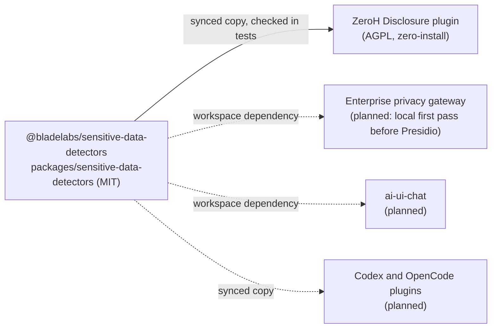

# @bladelabs/sensitive-data-detectors

Finds secrets and personal data in text, on the machine it runs on. It makes no network
calls and has no runtime dependencies (Node.js built-ins only). The source is plain ES modules
with a hand-written `index.d.ts` and runs as it is, so a consumer can copy `src/` and `vendor/`
without a build step.

License: MIT (see [LICENSE](LICENSE)). The vendored upstream code keeps its own licences
(see [NOTICE](NOTICE)).

The package is private to the Blade Labs monorepo for now. It is not published to npm.

## Contents

- [Use](#use)
- [API](#api)
- [What is detected](#what-is-detected)
- [Layout](#layout)
- [Updating the vendored code](#updating-the-vendored-code)
- [Who uses it](#who-uses-it)

## Use

```js
import { detect, catalog, TYPES } from '@bladelabs/sensitive-data-detectors';

const findings = detect('mail alice@example.com, key sk_live_…', {
  profile: 'prompt',
  region: 'GB',
});
// [{ type: 'EMAIL', risk: 'medium', start: 5, end: 22, length: 17, confidence: 0.9, source: … }, …]
```

Inside the monorepo, add `"@bladelabs/sensitive-data-detectors": "workspace:*"` to a
project's dependencies. Outside it (a plugin folder that must load with no install), copy the
package's runtime files; ZeroH Disclosure does this with a checked copy step (see
[Who uses it](#who-uses-it)).

Node.js 20 or later.

## API

`src/index.d.ts` has the full types.

| Export                                  | What it is                                                                                                                                                                                                 |
| --------------------------------------- | ---------------------------------------------------------------------------------------------------------------------------------------------------------------------------------------------------------- |
| `detect(text, options?)`                | Findings in `text`, sorted by position, overlaps resolved: `{ type, risk, start, end, length, confidence }`, plus `source` (personal data) or `ruleId`/`imported`/`generic` (secrets).                     |
| `detectEntropyWarnings(text, options?)` | Random-looking values that no rule found and that have no key-like name in front of them. Candidates for a warning, not for masking.                                                                       |
| `catalog()`                             | What the rule set detects: gitleaks provider rules by provider, named prefixes, personal-data kinds and the sources that decide them.                                                                      |
| `manifest()`                            | The engine id and its categories, for audit records.                                                                                                                                                       |
| `providerLabel(value)`                  | A provider name for a detected secret (`sk_live_…` is "Stripe live secret key"), or `null`.                                                                                                                |
| `TYPES`                                 | Every type a finding can have: the secret types, then the 33 personal-data kinds.                                                                                                                          |
| `SECRET_TYPES`                          | `PRIVATE_KEY`, `API_KEY`, `SECRET`, `TOKEN`, `PASSWORD`. Every other type is personal data.                                                                                                                |
| `PERSONAL_DATA_KINDS`                   | `{ type, name, label, source }` for each personal-data kind.                                                                                                                                               |
| `PROFILES`, `VERSIONS`                  | The profile names; the versions of gitleaks, validator.js, libphonenumber-js and the IANA list the rules come from.                                                                                        |
| Helpers                                 | `phoneRegion(env)`, `supportedRegion(region)`, `knownTopLevelDomain(domain)`, `shannonEntropy(value)`, `nameType(keyName)`, `looksLikeCodeValue(value, keyName)`, `GITLEAKS_CATALOG`, `TOP_LEVEL_DOMAINS`. |

`detectSensitiveData`, `detectionCatalog` and `detectorManifest` are the same functions as
`detect`, `catalog` and `manifest`.

### Options

| Option         | Default    | Meaning                                                                                                                                                                           |
| -------------- | ---------- | --------------------------------------------------------------------------------------------------------------------------------------------------------------------------------- |
| `profile`      | `'prompt'` | `prompt`: secrets and personal data, for text a person writes. `tool`: the same without national-format phone numbers, for tool output. `secrets`: secrets only.                  |
| `region`       | locale     | Default region for national-format phone numbers (`prompt` only): a two-letter region, `null` for none, or omitted for the locale's territory (`LC_ALL`, `LC_TELEPHONE`, `LANG`). |
| `enabledTypes` | all        | Only these types.                                                                                                                                                                 |
| `ignore`       | none       | `[start, end)` spans no finding may overlap, or a function `(text) => spans`. A consumer passes its own placeholders here so it never detects them again.                         |

International phone numbers (`+44 …`) are found with any region.

## What is detected

### Secrets

- **Provider key formats**: 221 rules from 129 providers, generated from the
  [gitleaks](https://github.com/gitleaks/gitleaks) v8.30.1 rule set, with their keywords,
  entropy thresholds and allowlists (translated from RE2 so every rule runs in linear time
  under JavaScript's backtracking engine: `(?i)` folds whole ranges, repeated capture groups
  become non-capturing, and unbounded leading context is checked separately); plus fixed-prefix rules for Anthropic, OpenAI, Stripe,
  GitHub, AWS, Google, Slack, npm, PyPI, Docker, HashiCorp Vault and others.
- **Local rules** (`SECRET_RULES` in `src/detector.js`) for formats the gitleaks release does
  not cover yet: GitHub App installation tokens (`ghs_`, the Actions `GITHUB_TOKEN` too) in the
  stateless format GitHub rolled out from April 2026, `ghs_<app id>_<JWT>` (about 520
  characters, two dots; gitleaks v8.30.1 matches only the 40-character form). The whole token
  is masked. Sources: GitHub's changelog of
  [2026-04-24](https://github.blog/changelog/2026-04-24-notice-about-upcoming-new-format-for-github-app-installation-tokens/)
  and [2026-05-15](https://github.blog/changelog/2026-05-15-github-app-installation-tokens-per-request-override-header/).
  GitHub has announced no new format for `ghp_`, `gho_`, `ghu_`, `ghr_` or `github_pat_`.
- **Secrets next to key-like names**: `password: …`, `db_password = …`, `"apiKey": "…"`,
  `AUTH_TOKEN=<random>`. Code after the name (`process.env.X`, a type, a call, a package
  version) and plain words are left alone.
- **Private keys** (PEM, OpenSSH, PuTTY, age), `Authorization` headers, credentials in URLs and
  connection strings, signed-URL signatures, OTP seeds and password hashes. A value after
  `Password=` is a value, a plain word in a sentence too: syntax cannot tell a word from a
  password, and a missed password leaks.
- **References are values.** Whether `$VAR`, `${VAR:-x}`, `$env:VAR`, `%VAR%`, `{{ x }}` or
  `${{ secrets.X }}` is expanded depends on which interpreter reads the text, which a detector
  cannot know; each exemption tried before 1.0.0 let a literal password through somewhere. So
  the detector judges no references: next to a secret-named key, in a URL password, in a
  connection string and in `curl -u`, a reference is masked like any value (in place, and
  restorable). Only upstream's own per-rule allowlists apply. gitleaks' global allowlist is not
  imported (planned for 1.1, with a channel-aware reading). Code expressions and format verbs
  after a key (`process.env.X`, `os.environ["X"]`, `%s`, `{name}`) are still not values.
  `test/rc2-gate.test.mjs` requires everything 1.0.0-rc.2 masked in its fixtures to stay
  masked, with no exceptions.
- **Entropy warnings** (separate function): long random-looking values with nothing naming them.

### Personal data

A vendored library or a published rule decides; the package's own code only proposes candidates
and keeps code and logs readable (SSH logins, noreply addresses, UUID digits, diff markers,
dates, version numbers and reference numbers are not personal data). 33 kinds:

| Type                        | Kind                                 | Decided by                                                    |
| --------------------------- | ------------------------------------ | ------------------------------------------------------------- |
| `EMAIL`                     | email addresses                      | validator.isEmail + IANA TLDs                                 |
| `CARD_NUMBER`               | card numbers (issuer range and Luhn) | validator.isCreditCard                                        |
| `IBAN`                      | IBANs (country format and checksum)  | validator.isIBAN                                              |
| `ES_NIF`                    | Spanish DNI numbers                  | validator.isIdentityCard('ES')                                |
| `ES_NIE`                    | Spanish NIE numbers                  | validator.isIdentityCard('ES')                                |
| `IT_FISCAL_CODE`            | Italian fiscal codes                 | validator.isTaxID('it-IT')                                    |
| `FI_PERSONAL_IDENTITY_CODE` | Finnish personal identity codes      | validator.isIdentityCard('FI')                                |
| `PHONE_NUMBER`              | phone numbers                        | libphonenumber-js                                             |
| `IP_ADDRESS`                | IP addresses                         | validator.isIP                                                |
| `CRYPTO`                    | Bitcoin and Ethereum addresses       | validator.isBtcAddress, validator.isEthereumAddress           |
| `US_SSN`                    | US Social Security numbers           | SSA assignment rules; Presidio UsSsnRecognizer invalid list   |
| `US_ITIN`                   | US ITINs                             | IRS Publication 4757                                          |
| `UK_NINO`                   | UK National Insurance numbers        | HMRC NIM39110                                                 |
| `QATAR_ID`                  | Qatar ID numbers                     | QID structure; ISO 3166-1 numeric (i18n-iso-countries)        |
| `IN_AADHAAR`                | Aadhaar numbers                      | validator.isIdentityCard('IN'): Verhoeff check digit          |
| `IN_PAN`                    | Indian PANs                          | Presidio InPanRecognizer format                               |
| `PK_CNIC`                   | Pakistani CNIC numbers               | validator.isIdentityCard('PK')                                |
| `EMIRATES_ID`               | Emirates ID numbers                  | Emirates ID format 784-YYYY-NNNNNNN-N                         |
| `SAUDI_NID`                 | Saudi national ID numbers            | Saudi-ID-Validator validateSAID                               |
| `IQAMA`                     | Saudi iqama numbers                  | Saudi-ID-Validator validateSAID                               |
| `BR_CPF`                    | Brazilian CPF numbers                | validator.isTaxID('pt-BR')                                    |
| `PL_PESEL`                  | Polish PESEL numbers                 | validator.isIdentityCard('PL')                                |
| `SE_PERSONNUMMER`           | Swedish personnummer                 | validator.isTaxID('sv-SE')                                    |
| `NL_BSN`                    | Dutch BSNs                           | validator.isTaxID('nl-NL'): the 11-proof                      |
| `CN_RESIDENT_ID`            | Chinese resident ID numbers          | validator.isIdentityCard('zh-CN')                             |
| `TW_NATIONAL_ID`            | Taiwanese national ID numbers        | validator.isIdentityCard('zh-TW')                             |
| `HK_IDENTITY_CARD`          | Hong Kong identity card numbers      | validator.isIdentityCard('zh-HK')                             |
| `NO_FODSELSNUMMER`          | Norwegian fødselsnummer              | validator.isIdentityCard('NO')                                |
| `TH_TNIN`                   | Thai national ID numbers             | validator.isIdentityCard('TH')                                |
| `IL_ID`                     | Israeli ID numbers                   | validator.isIdentityCard('he-IL')                             |
| `MALAYSIA_NRIC`             | Malaysian NRIC (MyKad) numbers       | JPN YYMMDD-PB-###G: a real date and a JPN place-of-birth code |
| `PASSPORT`                  | passport numbers (GB, US, MY)        | validator.isPassportNumber('GB', 'US', 'MY')                  |
| `DOB`                       | dates of birth                       | a real calendar date from 1900 to five years ago              |

Some kinds need a context word nearby (`QID`, `Aadhaar`, `DOB`, …), most only when written as
bare digits; the rules in `src/pii/national-ids.js` say which. Names, addresses and
currency amounts are not detected: they need a model, not a pattern.

ZeroH Disclosure's `docs/detection.md` has the measurements (false positives on real code and
logs) behind these rules.

## Layout

```
src/            the engine (runtime)
  index.js      the public API          index.d.ts   its types
  detector.js   secrets, profiles, dedupe, entropy warnings, catalog
  pii/          personal data: email, cards, IBANs, phones, IPs, crypto, national IDs
  rules/        generated rule data (gitleaks, IANA TLDs) and its NOTICE
vendor/         unchanged upstream files, each with LICENSE and SOURCE.json (runtime)
scripts/        import-*.mjs: fetch, pin and check the vendored files; regenerate src/rules
test/           node:test suites (node test/run.mjs, or the Nx test target)
dist/           the Nx build (git-ignored): tsdown's unbundled copy of src/
```

The runtime is `src/`, `vendor/`, `LICENSE`, `NOTICE` and `README.md`.

Workspace packages import the package by name. Like every package here, its `build` target
(tsdown, `--unbundle`) writes `dist/`, which the `import` condition points to, and the
`@bladelabs/source` condition points to `src/`. The build only transpiles: `dist/` keeps the
module layout, so it reads the same `vendor/` files, and a test checks that `dist/` and `src/`
give the same results.

## Updating the vendored code

Every upstream file is pinned: `vendor/<name>/SOURCE.json` records the tarball URL, its
integrity and each file's SHA-256; the generated rule files record the gitleaks version and
commit and the IANA list version.

1. Change the pinned version in the import script (`scripts/import-validator.mjs`,
   `import-libphonenumber.mjs`, `import-reference-data.mjs`; for gitleaks, the source path and
   `SOURCE_METADATA` in `import-gitleaks.mjs`; for IANA, replace
   `vendor/iana/tlds-alpha-by-domain.txt`).
2. Fetch: `node scripts/import-<name>.mjs --fetch` downloads the pinned files, verifies the
   integrity and rewrites `vendor/<name>/` and its `SOURCE.json`. For gitleaks and IANA, run
   `node scripts/import-gitleaks.mjs` or `node scripts/import-tlds.mjs` to regenerate
   `src/rules/`. For gitleaks, also update `SOURCE_METADATA.sha256` (the importer refuses any
   other file).
3. Check: `node scripts/import-<name>.mjs --check` fails when a vendored file or a generated
   rule file does not match its pin. The test target runs every check.
4. Test: `pnpm nx run sensitive-data-detectors:test`, then update `NOTICE` and this README
   when a version or a count changed.
5. Sync the consumers that copy the package: for ZeroH Disclosure,
   `pnpm nx run zeroh-marketplace:sync-detectors`.

`vendor/` is excluded from Prettier (root `.prettierignore`) so its bytes stay the upstream
bytes.

## Who uses it



- **ZeroH Disclosure** (`apps/zeroh-marketplace/plugins/zeroh-disclosure`) ships a copy in
  `vendor/sensitive-data-detectors/`, because Claude Code loads only the plugin folder and the
  plugin installs nothing. `pnpm nx run zeroh-marketplace:sync-detectors` writes the copy; the
  zeroh-marketplace test target fails when it differs from this package. The plugin adds its
  own concerns on top: its placeholder tokens (passed as `ignore`), `ZEROH_PHONE_REGION`,
  exact-match known values from `.env` and credential files, the vault, masking and hooks.
- **Planned**: the Enterprise privacy gateway as a local first pass before Presidio (the
  gateway is in the restricted privacy-services boundary and needs its owners), ai-ui-chat,
  and the Codex and OpenCode plugins.
